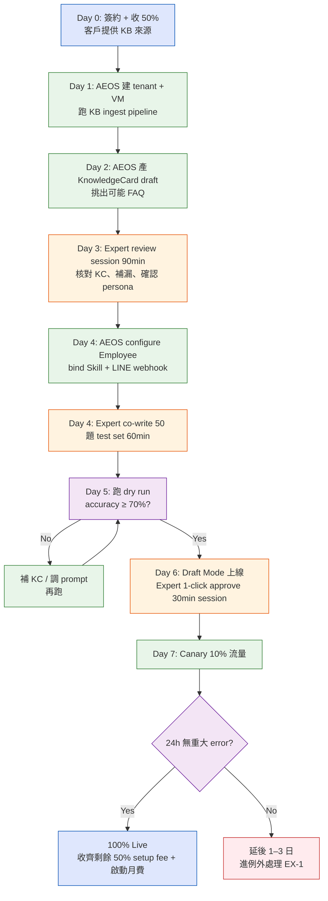

# BF-001 — 客戶 Onboarding 端到端 Business Flow

> 從「簽約」到「AI 員工 production live + 收齊款」的完整業務流程。
> 對應 PRD-001 §4 七天時程；本文件補充參與者、決策點、例外處理。

## 1. Trigger
客戶（pilot 企業）簽約 + 付 50% setup fee（≥ 25K NTD）。

## 2. Actors

| Actor | 代表組織 | 主要動作 |
|---|---|---|
| **客戶 CEO / 老闆** | Pilot 企業 | 簽約、付款、最終驗收 |
| **客戶 Expert** | Pilot 企業 | 提供 KB、共寫 test set、Draft Mode 1-click approve、簽核 Live |
| **AEOS CEO** | AEOS | 銷售、合約、款項追蹤 |
| **AEOS CTO / Onboarding Eng** | AEOS | KB ingest、tenant 設定、技術交付 |
| **AEOS System** | AEOS | KC 自動產生、Test runner、Draft Mode 處理、Audit log |

## 3. Happy Path（Day 0 → Day 7）

## 4. Decision Points

| ID | 時機 | 判斷 | 通過 → | 不通過 → |
|---|---|---|---|---|
| **DP-01** | Day 3 結束 | KC review 是否完成？≥ 80% draft approve | 進 Day 4 | 延 1 日，補 KB 來源（**EX-1**） |
| **DP-02** | Day 5 結束 | Test set pass rate ≥ 70% | 進 Day 6 Draft Mode | 補 KC / 改 prompt，最多重試 2 次（**EX-2**） |
| **DP-03** | Day 6 中 | Expert override 率 < 50% | 進 Day 7 Canary | 延 2 日，加強 Skill / KC（**EX-3**） |
| **DP-04** | Day 7 + 24h | Canary 期無 P0 incident | 100% Live | rollback to Draft Mode，啟動 root cause（**EX-4**） |

## 5. Exception Flows

### EX-1 — KB 品質不足
**觸發**：DP-01 不過 / Day 5 跑 test 多次拉不到 70%
**處理**：
1. AEOS Onboarding 寄列表給 Expert：哪些主題缺、需要什麼形式的補充
2. Expert 1 工作日內補資料；超時 → CEO 介入
3. 補完重跑 ingest + test；若三輪後仍不過 → 升級到 **EX-5**

### EX-2 — Test pass rate 拉不起來
**觸發**：DP-02 連 2 次不過
**處理**：CTO 介入做 prompt 工程；若仍不過 → 縮小 scope（從 FAQ 全集 → 只接最常見 20 題），延展 Phase 1 範圍

### EX-3 — Draft Mode override 率過高
**觸發**：DP-03 不過（Expert 改太多）
**處理**：分析 override 內容 → 抽 pattern → 補 KC 或調 Skill prompt → 再跑 1 天 Draft Mode

### EX-4 — Canary P0 incident
**觸發**：DP-04 不過（嚴重錯誤回覆、PII 外洩、tool 失敗）
**處理**：立即 kill switch（見 UF-005）→ rollback to Draft Mode → root cause → 修復 → 重新 canary

### EX-5 — Phase 1 失敗，重新校準
**觸發**：EX-1 三輪不過 / Day 14 仍未 Live
**處理**：CEO + CTO 與客戶坐下重談：
- 範圍縮小（再砍 50%）
- 或延長 timeline 到 Day 21
- 或退還 50% setup fee 終止合約（**最後手段**）

## 6. Inputs / Outputs

**Inputs**（客戶提供）：
- 合約 + 50% setup fee
- KB 來源（網站 URL、PDF、FAQ 表單、既有客服紀錄）
- LINE official account credentials
- 1 位 Expert 投入 ≤ 3 小時
- Persona 偏好（語氣、稱呼）

**Outputs**（AEOS 交付）：
- 1 個 production live AI 員工
- Audit log access（客戶可登入查 conversation）
- 每日 email digest
- Live 後 30 天 office hours
- Case study draft（客戶同意後 publish）

## 7. SLA / KPI

| 指標 | 目標 |
|---|---|
| Time to Live | ≤ 7 自然日（含 Decision Point 通過） |
| Expert hours 總投入 | ≤ 3 小時（4 個 session 加總） |
| Day 5 test pass rate | ≥ 70% |
| Live 後 第 1 週 accuracy | ≥ 80% |
| Setup fee 收齊率 | 100% |

## 8. RACI 摘要

| 活動 | R | A | C | I |
|---|---|---|---|---|
| 簽約 + 收款 | CEO | CEO | CTO | — |
| KB ingest + KC 產生 | CTO | CTO | Expert | CEO |
| Expert review session | CTO | CTO | Expert | CEO |
| Test set 共寫 | Expert | CTO | — | CEO |
| LINE setup | CTO | CTO | Expert | CEO |
| Draft Mode 接手 | Expert | CTO | — | CEO |
| Canary 監控 | CTO | CTO | — | CEO, Expert |
| Live + 後續支援 | CTO | CTO | Expert | CEO |

> R=Responsible（執行）、A=Accountable（負責）、C=Consulted（諮詢）、I=Informed（知會）

## 9. 連結

- 上層需求：`PRD-001-7day-ai-cs-onboarding.md`
- 拆解 User Flows：`UF-001` ~ `UF-005`
- 拆解 System Flows：`SF-001` ~ `SF-005`
- 例外 EX-4 緊急停機：`UF-005`
- 驗收標準：`AC-001` ~ `AC-005`
- 時程：`PROJ-001`
