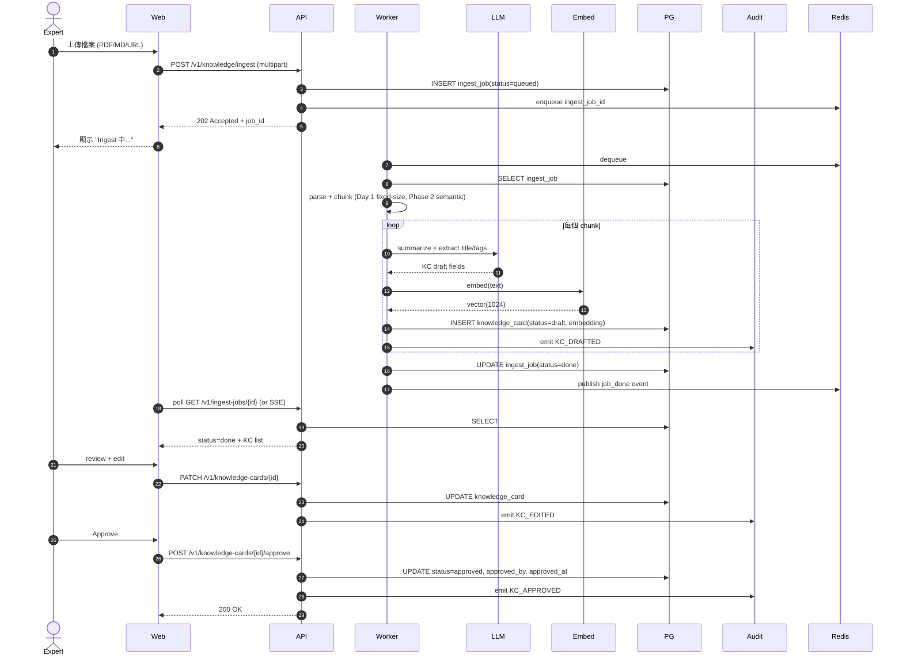
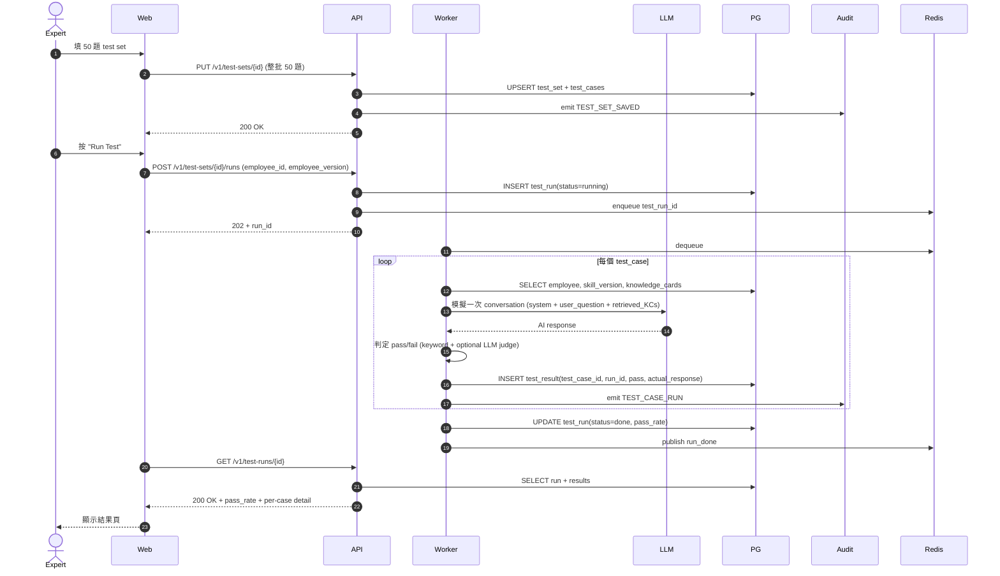
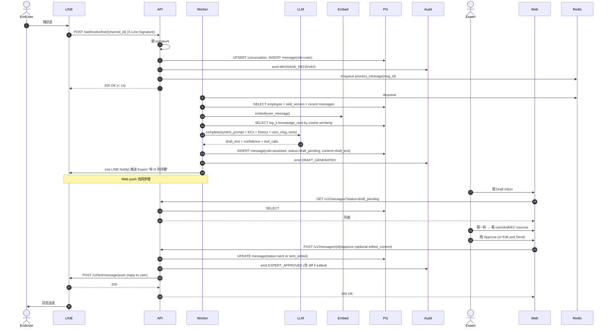
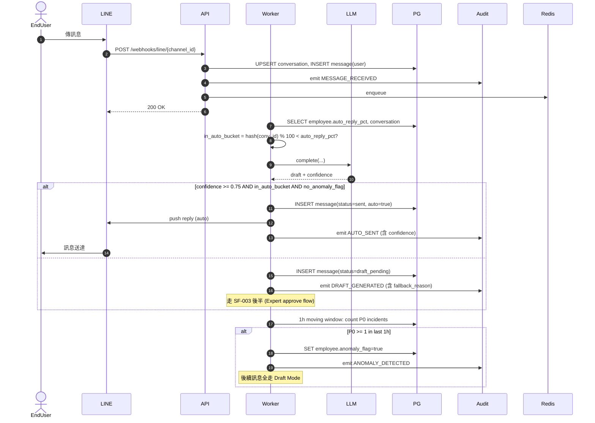
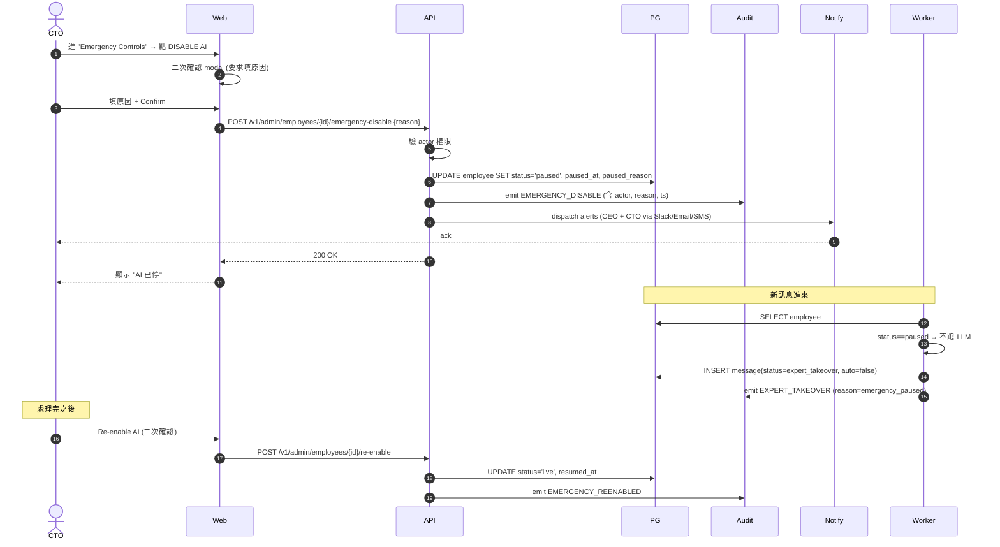

# System Flows v0 — SF-001 到 SF-005

> 每個 SF 對應一個 UF；用 Mermaid sequenceDiagram 表示系統 module 間的呼叫順序。
> Module 名與 SAD（`docs/2-contracts/SAD-v0.1.md`）的 container 一致。

## Naming Convention

- `Expert` / `EndUser` — actor
- `LINE` — LINE Platform
- `Web` — AEOS 後台 SPA
- `API` — AEOS API gateway / FastAPI app
- `Worker` — async job processor
- `LLM` — Anthropic Claude API
- `Embed` — embedding service（Phase 1 用 Anthropic 或 sentence-transformers）
- `PG` — PostgreSQL（含 pgvector）
- `Redis` — Redis（queue + cache）
- `Audit` — Audit logger（thin wrapper, writes to PG audit_event）

---

## SF-001 — KB Upload → KC Draft → Approve

---

## SF-002 — Test Set Run

---

## SF-003 — LINE Inbound → Draft Mode → Expert Approve

---

## SF-004 — Canary Auto Reply with Confidence Threshold

---

## SF-005 — Emergency Kill Switch

---

## SF 共通模式

| 模式 | 適用 SF |
|---|---|
| **Async 處理**：API 收到後立即 ACK + enqueue，Worker 背景處理 | SF-001, SF-002, SF-003, SF-004 |
| **Audit 強制 emit**：任何 state transition 必發 AuditEvent | 全部 |
| **Idempotency**：所有 POST 帶 `Idempotency-Key` header，Worker dedupe | 全部 |
| **Retry / Dead-letter**：Worker 失敗 → retry 3 次（exp backoff）→ DLQ | SF-001, SF-002, SF-003, SF-004 |
| **PII pseudonymize at boundary**：API gateway 入口層做（見 ADR-0005） | SF-003, SF-004 |

## 連結

- 對應 User Flows：`UF-001` ~ `UF-005`
- 後端 API spec：`API-001-internal.md`
- LINE webhook spec：`API-002-line-webhook.md`
- Architecture：`SAD-v0.1.md`
- Data model：`domain-model.md`
