# Slide 2 — AEOS SA 流程架構圖 (Solution Architecture Process Flow)

> **用途**：給 GPT-4o / DALL-E 3 / Midjourney 等 image generation tool 生成流程圖
> **建議工具**：GPT-4o image generation (英文 prompt 準確度最高)
> **對應白皮書章節**：§9 SkillOps Pipeline、§17 五階段方法論、§18 Onboarding Layer、§29.5~29.7 三個 Compiler、§10 訓練室

---

## 設計目標

呈現**從客戶混亂資料到上線 AI 藍領員工的完整管線**：
- 主鏈路 (Forward Pipeline)：上半部，Phase 0 → Phase 4 由左至右
- 閉環 (Feedback Loop)：下半部，Production → Evaluation → Training Room (右→左)
- 三個 Compiler：Data→Knowledge / Knowledge→Skill / Conversation→Iteration
- 訓練室 vs 生產環境分離原則

---

## 視覺結構

```
方向：水平流程 (Left → Right = Customer Data → Production)
分層：上半部主鏈路、下半部閉環
時序：橫向 5 階段 Phase 0~4 區塊化標註
階段切換：垂直虛線區隔 Phase
強調：3 個 Compiler 用大型菱形標出
比例：16:9
```

### 色彩語意

| 顏色 | 階段 | Hex |
| :--- | :--- | :--- |
| 淺藍 | Phase 0/1 — Discovery & Modeling | #DBEAFE |
| 藍色 | Phase 2 — Training Room | #3B82F6 |
| 紫色 | Phase 3 — Deployment | #8B5CF6 |
| 橘色 | Phase 4 — Operation (customer-facing) | #F59E0B |
| 綠色 | Compiler 菱形 (3 個關鍵轉換點) | #10B981 |
| 灰色虛線 | Feedback loop | #9CA3AF |

### 圖形語意

| 形狀 | 語意 |
| :--- | :--- |
| 圓角矩形 | 流程 (Process) |
| 菱形 | Compiler (轉換節點) |
| 圓柱 | 資料儲存 (Data Store) |
| 平行四邊形 | 輸入 / 輸出 (Input/Output) |
| 實線箭頭 | 主流程 (Forward) |
| 虛線箭頭 | 回饋迴路 (Feedback) |

---

## 元素清單

### 上半部 — 主鏈路 (Forward Pipeline，左→右)

#### Phase 0 — Discovery (需求盤點，淺藍)

```
[Input parallelogram] Customer Interview
[Input parallelogram] Existing Channels (LINE / Web / Email)
       ↓
[Process rectangle] Job Description Doc + Risk Matrix
```

#### Phase 1 — Modeling (知識建模，淺藍)

```
[Cylinder] Raw Data Sources
  ├── Website / FAQ / PDF
  ├── Notion / Confluence
  ├── LINE / Email logs
  └── Zendesk / Intercom tickets
       ↓
◆ COMPILER 1: Data → Knowledge ◆ (綠色菱形，醒目)
       ↓
[Knowledge Cards stack] (5 種卡片堆疊)
  ├── FAQ Card
  ├── Policy Card
  ├── Product Card
  ├── Procedure Card
  └── Risk Card
```

#### Phase 2 — Training Room (沙盒陪練，藍色)

```
◆ COMPILER 2: Knowledge → Skill ◆ (綠色菱形)
       ↓
[Sandbox container]
  ├── Domain Expert (icon) — 專家陪練
  ├── Auto-generated test set (50~100 questions)
  └── Red Team adversarial (7 種攻擊樣式)
       ↓
[Horizontal bars] 7-layer Quality Gates
       ↓
[Signature icon] Expert Review Approval
```

#### Phase 3 — Deployment (灰度上線，紫色)

```
[Cylinder versioned] Skill Registry (v1.0 / v1.1 / v1.2)
       ↓
[YAML icon] AI Blue-collar Employee Manifest
       ↓
[Gauge icon] Canary Release (10%)
       ↓
[Shield icon] Tool Gateway (Policy + Audit + Mask)
       ↓
[Locked container icon] Production Frozen Runtime
```

#### Phase 4 — Operation (監控迭代，橘色)

```
[Channel icons] LINE / WhatsApp / Mobile App
       ↓
[Chat bubbles] Customer Frontline Conversations
       ↓
[Document icon] Audit Log
```

### 下半部 — 閉環 (Feedback Loop，右→左，灰色虛線)

```
[Cylinder, right side] Conversation Logs (Production)
       ↓ (灰虛線)
[Box] Evaluation Service (AgentOps)
  ├── FCR / AHT / CSAT
  ├── Hallucination rate
  ├── SOP compliance
  └── Drift detection
       ↓
◆ COMPILER 3: Conversation → Iteration ◆ (綠色菱形)
       ↓
[Small boxes] Failure Taxonomy + PII Masking
       ↓ (虛線箭頭迴繞，回到 Phase 2 Training Room)
標籤："retraining"
```

---

## GPT-4o Image Generation Prompt (English — 主要使用)

```
Create a professional enterprise process architecture diagram titled
"AEOS — Solution Architecture Process Flow — From Customer Data to Production AI Blue-collar Worker".

Layout: Horizontal flow diagram, left to right, with 5 phase columns
(Phase 0 to Phase 4). Top half = Forward Pipeline. Bottom half = Feedback Loop
(arrows flowing right to left, returning to Phase 2).

Visual style: Clean modern process diagram, similar to AWS Step Functions /
MLOps pipeline diagrams. White background, rounded rectangles for processes,
diamonds for "Compilers" (decision/transformation points), cylinders for data stores,
parallelograms for inputs/outputs. Use thin solid arrows for flow, dashed arrows
for feedback loop. Use vertical dashed gray lines to separate the 5 phases.

Color coding:
- Light blue (#DBEAFE) = Phase 0/1 — Discovery & Modeling
- Blue (#3B82F6) = Phase 2 — Training Room
- Purple (#8B5CF6) = Phase 3 — Deployment
- Orange (#F59E0B) = Phase 4 — Operation (customer-facing)
- Green (#10B981) = Compiler diamonds (the 3 key transformations)
- Gray dashed = Feedback loop

PHASE COLUMNS (top half, left to right):

Phase 0 "Discovery" (light blue):
  - [Input] Customer Interview (parallelogram)
  - [Input] Existing Channels (parallelogram)
  - → Job Description Doc + Risk Matrix (rectangle)

Phase 1 "Modeling" (light blue):
  - Raw Data Sources cylinder: Website, FAQ, PDF, Notion, LINE logs, Tickets
  - ◆ DIAMOND in green: "COMPILER 1: Data → Knowledge"
  - 5 small cards: FAQ Card, Policy Card, Product Card, Procedure Card, Risk Card
    (arranged as a stack of knowledge cards)

Phase 2 "Training Room" (blue):
  - ◆ DIAMOND in green: "COMPILER 2: Knowledge → Skill"
  - Sandbox container with: Domain Expert (icon), Test Set (50-100 Q),
    Red Team adversarial
  - "7-layer Quality Gates" as horizontal bars
  - Expert Review Approval (signature icon)

Phase 3 "Deployment" (purple):
  - Skill Registry (cylinder, versioned with v1.0, v1.1, v1.2 labels)
  - AI Employee Manifest (YAML icon)
  - Canary Release "10%" (gauge icon)
  - Tool Gateway (shield icon with "Policy + Audit + Mask")
  - Production Frozen Runtime (locked container icon)

Phase 4 "Operation" (orange):
  - Channel Layer: LINE, WhatsApp, Mobile App icons
  - Customer Frontline Conversations (chat bubbles)
  - Audit Log (document icon)

BOTTOM HALF — FEEDBACK LOOP (gray dashed arrows, right → left):

- Conversation Logs cylinder (right side)
- Evaluation Service box: FCR, AHT, CSAT, Hallucination rate, SOP compliance,
  Drift detection (as bullet list inside)
- ◆ DIAMOND in green: "COMPILER 3: Conversation → Iteration"
- Failure Taxonomy + PII Masking (small boxes)
- Dashed arrow loops back to Phase 2 Training Room with label "retraining"

LEGEND at bottom-right:
- Rectangle = Process
- Diamond = Compiler (key transformation)
- Cylinder = Data Store
- Parallelogram = Input/Output
- Solid arrow = Forward flow
- Dashed arrow = Feedback loop

Title in bold sans-serif at top.
Sub-title: "5 Phases × 3 Compilers × 1 Closed-loop SkillOps Pipeline"
16:9 aspect ratio. All English labels.
```

---

## GPT-4o 中文備援 Prompt

```
建立一張專業企業流程架構圖，標題為
「AEOS — SA 流程架構 — 從客戶資料到上線 AI 藍領員工」。

排版：水平流程圖，左→右，分為 5 個 Phase 直欄 (Phase 0~4)。
上半部為主鏈路 (Forward Pipeline)，下半部為閉環 (Feedback Loop, 右→左)。

視覺風格：簡潔現代流程圖，類似 AWS Step Functions / MLOps pipeline 風格。
白底、圓角矩形 = 流程；菱形 = Compiler (轉換節點)；
圓柱 = 資料儲存；平行四邊形 = 輸入/輸出。
實線箭頭 = 主流程；虛線箭頭 = 回饋迴路。
垂直灰色虛線分隔 5 個 Phase。

色彩：
- 淺藍 (#DBEAFE) = Phase 0/1
- 藍色 (#3B82F6) = Phase 2 訓練室
- 紫色 (#8B5CF6) = Phase 3 部署
- 橘色 (#F59E0B) = Phase 4 營運
- 綠色 (#10B981) = Compiler 菱形
- 灰虛線 = 回饋迴路

[5 個 Phase 直欄，由左至右]

Phase 0「Discovery」(淺藍)：
  - 平行四邊形 [Input]：Customer Interview
  - 平行四邊形 [Input]：Existing Channels
  - → 矩形：Job Description Doc + Risk Matrix

Phase 1「Modeling」(淺藍)：
  - 圓柱：Raw Data Sources (Website, FAQ, PDF, Notion, LINE logs, Tickets)
  - ◆ 綠色菱形：「COMPILER 1: Data → Knowledge」
  - 5 張小卡片堆疊：FAQ Card, Policy Card, Product Card, Procedure Card, Risk Card

Phase 2「Training Room」(藍色)：
  - ◆ 綠色菱形：「COMPILER 2: Knowledge → Skill」
  - Sandbox 容器：Domain Expert (icon), Test Set (50-100 Q), Red Team adversarial
  - 「7-layer Quality Gates」水平條帶
  - Expert Review Approval (簽名 icon)

Phase 3「Deployment」(紫色)：
  - 圓柱 Skill Registry (含 v1.0 / v1.1 / v1.2 版本標籤)
  - AI Employee Manifest (YAML icon)
  - Canary Release「10%」(儀表 icon)
  - Tool Gateway (盾牌 icon，含「Policy + Audit + Mask」)
  - Production Frozen Runtime (鎖定容器 icon)

Phase 4「Operation」(橘色)：
  - Channel Layer: LINE, WhatsApp, Mobile App icons
  - Customer Frontline Conversations (對話泡泡)
  - Audit Log (文件 icon)

[下半部 — 回饋迴路，灰虛線箭頭，右→左]

- 圓柱 Conversation Logs (右側)
- Evaluation Service 方框: FCR, AHT, CSAT, Hallucination rate,
  SOP compliance, Drift detection (條列在內)
- ◆ 綠色菱形：「COMPILER 3: Conversation → Iteration」
- Failure Taxonomy + PII Masking (小方框)
- 虛線箭頭迴繞回 Phase 2 訓練室，標籤「retraining」

[圖例放底部右下]
- 矩形 = Process
- 菱形 = Compiler (key transformation)
- 圓柱 = Data Store
- 平行四邊形 = Input/Output
- 實線箭頭 = Forward flow
- 虛線箭頭 = Feedback loop

標題粗體無襯線置頂。
副標題：「5 Phases × 3 Compilers × 1 Closed-loop SkillOps Pipeline」
16:9 比例。
```

---

## 各工具使用建議

| 工具 | 建議用法 |
| :--- | :--- |
| **GPT-4o image generation** | 直接貼上述英文 prompt，輸出品質最高 |
| **DALL-E 3** | 英文 prompt + `--style mlops pipeline diagram` |
| **Midjourney v6** | 英文 prompt 末加 `--ar 16:9 --style enterprise process diagram --v 6` |
| **Excalidraw / draw.io** | 用「元素清單」段落作為手繪 checklist |
| **Mermaid flowchart** | 可額外請求轉換為純文字 mermaid 程式碼版本 |

---

## 預期輸出檢核

生成圖片後檢核下列要點：

```
□ 5 個 Phase 由左至右順序正確 (Phase 0 → 4)
□ 上半部為主流程實線箭頭
□ 下半部為灰虛線回饋迴路
□ 3 個綠色菱形 Compiler 醒目可見
□ 訓練室 (Phase 2) 與生產 (Phase 3) 之間有明確區隔
□ Tool Gateway 在 Phase 3 含 Policy + Audit + Mask 三標籤
□ Feedback loop 從右側 Conversation Logs 回到左側 Phase 2
□ 副標題「5 Phases × 3 Compilers × 1 Closed-loop SkillOps Pipeline」
□ 16:9 比例
□ 圖例完整 (6 種圖形 / 箭頭意義)
```

---

## Mermaid 純文字版本 (備用，供 markdown 渲染)

```mermaid
flowchart LR
    subgraph P0["Phase 0 — Discovery"]
        I1[/Customer Interview/]
        I2[/Existing Channels/]
        JD[Job Description<br/>+ Risk Matrix]
        I1 --> JD
        I2 --> JD
    end

    subgraph P1["Phase 1 — Modeling"]
        RAW[(Raw Data Sources)]
        C1{{COMPILER 1<br/>Data → Knowledge}}
        KC[Knowledge Cards<br/>FAQ/Policy/Product/Procedure/Risk]
        RAW --> C1 --> KC
    end

    subgraph P2["Phase 2 — Training Room"]
        C2{{COMPILER 2<br/>Knowledge → Skill}}
        SANDBOX[Sandbox<br/>Expert + Test Set + Red Team]
        QG[7-layer Quality Gates]
        APPROVAL[Expert Review]
        C2 --> SANDBOX --> QG --> APPROVAL
    end

    subgraph P3["Phase 3 — Deployment"]
        SR[(Skill Registry<br/>v1.0/v1.1/v1.2)]
        MANIFEST[Employee Manifest]
        CANARY[Canary 10%]
        TG[Tool Gateway<br/>Policy+Audit+Mask]
        FROZEN[Frozen Runtime]
        SR --> MANIFEST --> CANARY --> TG --> FROZEN
    end

    subgraph P4["Phase 4 — Operation"]
        CH[Channels<br/>LINE/WhatsApp/Mobile]
        CONV[Customer Conversations]
        AUDIT[Audit Log]
        CH --> CONV --> AUDIT
    end

    JD --> RAW
    KC --> C2
    APPROVAL --> SR
    FROZEN --> CH

    subgraph FEEDBACK["Feedback Loop (Compiler 3)"]
        LOGS[(Conversation Logs)]
        EVAL[Evaluation Service<br/>FCR/AHT/CSAT/Hallucination/SOP/Drift]
        C3{{COMPILER 3<br/>Conversation → Iteration}}
        TAX[Failure Taxonomy<br/>+ PII Masking]
    end

    AUDIT -.-> LOGS
    LOGS -.-> EVAL
    EVAL -.-> C3
    C3 -.-> TAX
    TAX -.->|retraining| C2
```


