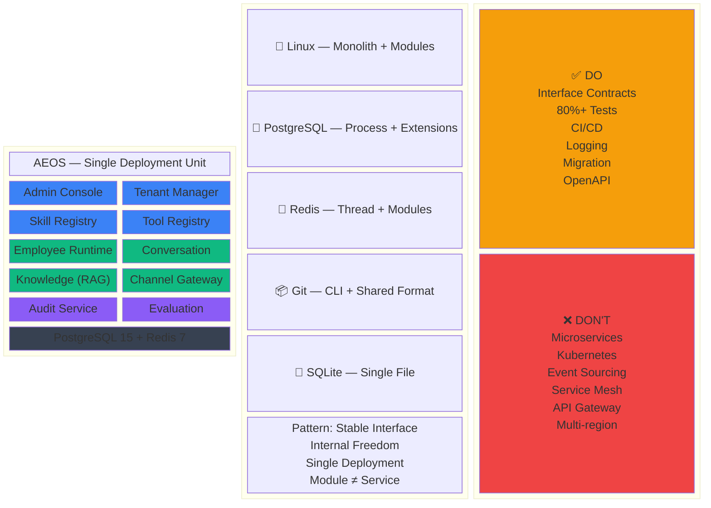

# Slide 3 — AEOS 架構哲學圖 (Architecture Philosophy — Why Modular Monolith)

> **用途**：給 GPT-4o / DALL-E 3 / Midjourney 等 image generation tool 生成投影片
> **建議工具**：GPT-4o image generation (英文 prompt 準確度最高)
> **對應章節**：SAD-v0.1 §deployment model、ADR-0004、本次架構取捨討論

---

## 設計目標

一頁投影片同時傳達三件事：
1. **AEOS 的系統全貌**：3 大系統 × 9 子系統的模組邊界
2. **為什麼選 Modular Monolith**：對照長青系統（Linux/PG/Redis/Git）的共同特徵
3. **投資判斷**：該投資什麼 vs 不該投資什麼（Phase 1 取捨矩陣）

核心訊息：**「在對的地方嚴格、在其他地方自由」— 介面嚴格、實作自由、部署簡單。**

---

## 視覺結構

```
方向：三欄式佈局 (左 40% / 中 30% / 右 30%)
左欄：AEOS 系統模組圖（主視覺）
中欄：長青系統對照表 + 共同 DNA
右欄：Phase 1 投資矩陣（做 vs 不做）
底部：一句話總結 (tagline)
比例：16:9
```

### 色彩語意

| 顏色 | 語意 | Hex |
| :--- | :--- | :--- |
| 藍色 | Control Plane (管理面) | #3B82F6 |
| 綠色 | Data Plane (運行面) | #10B981 |
| 紫色 | Governance Plane (治理面) | #8B5CF6 |
| 深灰 | 共用基礎層 (DB/Redis/Queue) | #374151 |
| 橘色 | 該投資 (Do) | #F59E0B |
| 紅色 | 不該投資 (Don't) | #EF4444 |
| 淺灰 | 背景 / 分隔線 | #F3F4F6 |

---

## 元素清單

### 左欄 — AEOS Modular Monolith（主視覺，佔 40%）

```
標題：「One Codebase, Clear Boundaries」

外框：一個大圓角矩形，代表「Single Deployment Unit」
內部分三個色帶區，每區含子模組方塊：

┌─────────────────────────────────────────┐
│  AEOS — Single Deployment Unit          │
│                                         │
│  ┌─ Control Plane (藍) ──────────────┐  │
│  │  Admin Console  │  Tenant Mgr     │  │
│  │  Skill Registry │  Tool Registry  │  │
│  └───────────────────────────────────┘  │
│                                         │
│  ┌─ Data Plane (綠) ────────────────┐   │
│  │  Employee Runtime │ Conversation  │  │
│  │  Knowledge (RAG)  │ Channel GW    │  │
│  └───────────────────────────────────┘  │
│                                         │
│  ┌─ Governance Plane (紫) ──────────┐   │
│  │  Audit Service   │ Evaluation    │   │
│  │  Training Room (Phase 2)         │   │
│  └───────────────────────────────────┘  │
│                                         │
│  ┌─ Shared Foundation (深灰) ───────┐   │
│  │  PostgreSQL 15  │  Redis 7       │   │
│  │  + pgvector     │  + Task Queue  │   │
│  └───────────────────────────────────┘  │
│                                         │
└─────────────────────────────────────────┘

模組之間：虛線箭頭標示「Interface Only」
模組內部：實線，表示可自由重構

左下角小圖示：
  🔒 介面嚴格 (Lock icon on module boundaries)
  🔓 實作自由 (Unlock icon inside modules)
```

### 中欄 — Evergreen Systems DNA（佔 30%）

```
標題：「35-Year Systems Share One DNA」

5 個長青系統 icon + 年齡 + 架構類型，垂直排列：

🐧 Linux Kernel     (1991, 35yr)  — Monolith + Modules
🐘 PostgreSQL       (1996, 30yr)  — Single Process + Extensions
🔴 Redis            (2009, 17yr)  — Single Thread + Modules
📦 Git              (2005, 21yr)  — CLI Tools + Shared Format
💎 SQLite           (2000, 26yr)  — Single File, Zero Config

下方：一個提取框 (callout box)，標題「Shared Pattern」：
  ✅ Stable Interface (介面穩定)
  ✅ Internal Freedom (內部可演化)
  ✅ Single Deployment (部署簡單)
  ✅ Module Boundary ≠ Service Boundary
  ❌ None of them are microservices
```

### 右欄 — Phase 1 Investment Matrix（佔 30%）

```
標題：「Where to Invest Complexity」

上半：橘色區塊「DO — 成本低，收益持久」
  ✅ Module Interface Contracts
  ✅ 80%+ Test Coverage
  ✅ CI/CD Automation
  ✅ Structured Logging + Tracing
  ✅ DB Migration (Alembic)
  ✅ API Contract (OpenAPI)

下半：紅色區塊「DON'T — 成本高，Phase 1 無收益」
  ❌ Microservice Split
  ❌ Kubernetes
  ❌ Event Sourcing / CQRS
  ❌ Service Mesh (Istio)
  ❌ Separate API Gateway
  ❌ Multi-region Deploy

兩區之間：一條分隔線 + 標籤
  「AI lowers CODE cost, not OPS cost」
```

### 底部 — Tagline（全寬）

```
大字引言（粗體，置中）：

  "Be strict where it matters, free everywhere else."
  「在對的地方嚴格，在其他地方自由 — 介面嚴格、實作自由、部署簡單」

右下：AEOS logo + 「Phase 1 Architecture Decision — 2026」
```

---

## GPT-4o Image Generation Prompt (English)

```
Create a professional one-page presentation slide titled
"AEOS Architecture Philosophy — Why Modular Monolith Wins".

Layout: Three-column layout on white background. Left column 40% width,
middle column 30%, right column 30%. Full-width tagline bar at bottom.
16:9 aspect ratio.

Visual style: Clean, modern presentation slide. Rounded rectangles,
subtle shadows, professional enterprise look. Similar to a McKinsey or
Thoughtworks technology radar slide.

=== LEFT COLUMN (40%) — "One Codebase, Clear Boundaries" ===

A large rounded rectangle labeled "AEOS — Single Deployment Unit"
containing 4 horizontal bands stacked vertically:

Band 1 (Blue #3B82F6): "Control Plane" containing 4 boxes:
  Admin Console, Tenant Manager, Skill Registry, Tool Registry

Band 2 (Green #10B981): "Data Plane" containing 4 boxes:
  Employee Runtime, Conversation Engine, Knowledge (RAG), Channel Gateway

Band 3 (Purple #8B5CF6): "Governance Plane" containing 3 boxes:
  Audit Service, Evaluation Service, Training Room (grayed out, labeled "Phase 2")

Band 4 (Dark gray #374151): "Shared Foundation" containing:
  PostgreSQL 15 + pgvector, Redis 7 + Task Queue

Between the bands: dashed lines with label "Interface Only" (meaning
modules communicate through defined interfaces only).

Small icons at bottom-left:
  Lock icon + "Strict Interfaces" (on module boundaries)
  Unlock icon + "Free Internals" (inside modules)

=== MIDDLE COLUMN (30%) — "35-Year Systems Share One DNA" ===

5 rows, each showing an iconic system with its age and architecture:
  - Linux penguin icon: "Linux Kernel (1991) — Monolith + Modules"
  - Elephant icon: "PostgreSQL (1996) — Single Process + Extensions"
  - Red diamond: "Redis (2009) — Single Thread + Modules"
  - Git branch icon: "Git (2005) — CLI Tools + Shared Format"
  - Blue gem: "SQLite (2000) — Single File, Zero Config"

Below: a highlighted callout box titled "Shared Pattern":
  ✅ Stable Interface
  ✅ Internal Freedom
  ✅ Single Deployment
  ✅ Module ≠ Service
  ❌ None are microservices

=== RIGHT COLUMN (30%) — "Where to Invest Complexity" ===

Two stacked boxes:

Top box (Orange #F59E0B background, labeled "DO — Low cost, lasting value"):
  ✅ Module Interface Contracts
  ✅ 80%+ Test Coverage
  ✅ CI/CD Automation
  ✅ Structured Logging + Tracing
  ✅ DB Migration Strategy
  ✅ API Contract (OpenAPI)

Bottom box (Red #EF4444 background, labeled "DON'T — High cost, no Phase 1 value"):
  ❌ Microservice Split
  ❌ Kubernetes
  ❌ Event Sourcing / CQRS
  ❌ Service Mesh
  ❌ Separate API Gateway
  ❌ Multi-region Deploy

Between the two boxes, a divider line with text:
  "AI lowers CODE cost, not OPS cost"

=== BOTTOM BAR (full width) ===

Centered quote in large bold text:
  "Be strict where it matters, free everywhere else."

Below in smaller text:
  "介面嚴格、實作自由、部署簡單"

Bottom-right corner: "AEOS — Phase 1 Architecture Decision — 2026"

=== ADDITIONAL NOTES ===
- Use professional, muted colors — not neon
- All text must be clearly readable
- No decorative illustrations — information-dense, every element carries meaning
- Subtle grid lines or alignment guides to keep the three columns visually balanced
```

---

## GPT-4o 中文備援 Prompt

```
建立一張專業投影片，標題為「AEOS 架構哲學 — 為什麼選 Modular Monolith」。

排版：三欄佈局，白底。左欄 40%、中欄 30%、右欄 30%。底部全寬標語列。
16:9 比例。

視覺風格：簡潔現代的簡報投影片，圓角矩形、輕微陰影、專業企業風格。
類似 McKinsey 或 Thoughtworks 技術雷達報告的版面。

=== 左欄 (40%) —「一套程式碼，清晰邊界」===

一個大圓角矩形標示「AEOS — Single Deployment Unit」，
內含 4 個水平色帶由上而下：

色帶 1（藍色 #3B82F6）：「Control Plane 管理面」
  含 4 個方塊：Admin Console、Tenant Manager、Skill Registry、Tool Registry

色帶 2（綠色 #10B981）：「Data Plane 運行面」
  含 4 個方塊：Employee Runtime、Conversation Engine、Knowledge (RAG)、Channel Gateway

色帶 3（紫色 #8B5CF6）：「Governance Plane 治理面」
  含 3 個方塊：Audit Service、Evaluation Service、Training Room（灰色，標「Phase 2」）

色帶 4（深灰 #374151）：「Shared Foundation 共用基礎」
  含：PostgreSQL 15 + pgvector、Redis 7 + Task Queue

色帶之間用虛線連接，標示「Interface Only」（模組間只透過介面溝通）。

左下角小圖示：
  鎖 icon +「介面嚴格」
  開鎖 icon +「實作自由」

=== 中欄 (30%) —「35 年長青系統的共同 DNA」===

5 列，每列一個經典系統 + 年齡 + 架構：
  - 企鵝 icon：Linux Kernel (1991) — 單體 + 模組
  - 大象 icon：PostgreSQL (1996) — 單 Process + Extension
  - 紅色菱形：Redis (2009) — 單執行緒 + Module
  - Git 分支 icon：Git (2005) — CLI 工具集 + 共用格式
  - 藍色寶石：SQLite (2000) — 單一檔案、零配置

下方高亮框，標題「共同模式」：
  ✅ 介面穩定
  ✅ 內部可演化
  ✅ 部署簡單
  ✅ 模組邊界 ≠ 服務邊界
  ❌ 沒有一個是微服務

=== 右欄 (30%) —「複雜度投資在哪裡」===

兩個堆疊方框：

上方（橘色 #F59E0B 底，標題「DO — 成本低，收益持久」）：
  ✅ 模組介面契約
  ✅ 80%+ 測試覆蓋率
  ✅ CI/CD 自動化
  ✅ 結構化 Logging + Tracing
  ✅ DB Migration 策略
  ✅ API 契約 (OpenAPI)

下方（紅色 #EF4444 底，標題「DON'T — 成本高，Phase 1 無收益」）：
  ❌ 微服務拆分
  ❌ Kubernetes
  ❌ Event Sourcing / CQRS
  ❌ Service Mesh
  ❌ 獨立 API Gateway
  ❌ 多區域部署

兩框之間分隔線 + 文字：「AI 降低的是寫 code 的成本，不是運維的成本」

=== 底部（全寬）===

置中大字粗體引言：
  "Be strict where it matters, free everywhere else."

下方小字：
  「在對的地方嚴格，在其他地方自由 — 介面嚴格、實作自由、部署簡單」

右下角：AEOS — Phase 1 Architecture Decision — 2026
```

---

## 各工具使用建議

| 工具 | 建議用法 |
| :--- | :--- |
| **GPT-4o image generation** | 直接貼英文 prompt，輸出品質最高 |
| **DALL-E 3** | 英文 prompt + `--style presentation slide` |
| **Midjourney v6** | 英文 prompt 末加 `--ar 16:9 --style enterprise slide --v 6` |
| **Excalidraw / draw.io** | 用「元素清單」段落作為手繪 checklist |
| **Canva / Keynote / PowerPoint** | 手動排版三欄式，用色彩語意表對照 |
| **Mermaid** | 見下方純文字版本 |

---

## Mermaid 純文字版本 (備用，供 markdown 渲染)



---

## 預期輸出檢核

生成圖片後檢核下列要點：

```
□ 三欄佈局清晰，比例約 40/30/30
□ 左欄外框明確標示「Single Deployment Unit」
□ 左欄四個色帶（藍/綠/紫/深灰）區分清楚
□ 模組之間有虛線 + 「Interface Only」標示
□ 中欄 5 個長青系統各有 icon + 年齡 + 架構類型
□ 中欄底部「Shared Pattern」框含 4 個 ✅ + 1 個 ❌
□ 右欄 DO (橘) / DON'T (紅) 對比鮮明
□ 兩區之間有「AI lowers CODE cost, not OPS cost」標語
□ 底部引言清晰可讀
□ 16:9 比例
□ 整體風格專業、資訊密度高、無多餘裝飾
```
