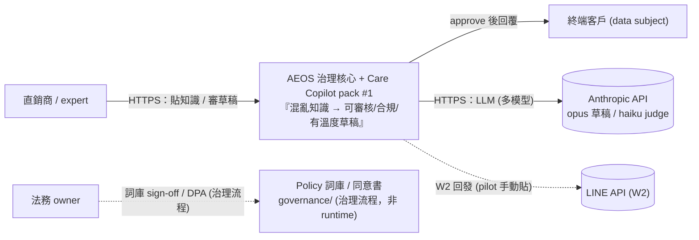
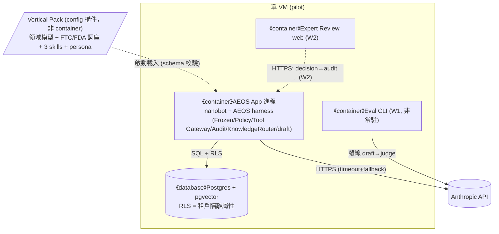
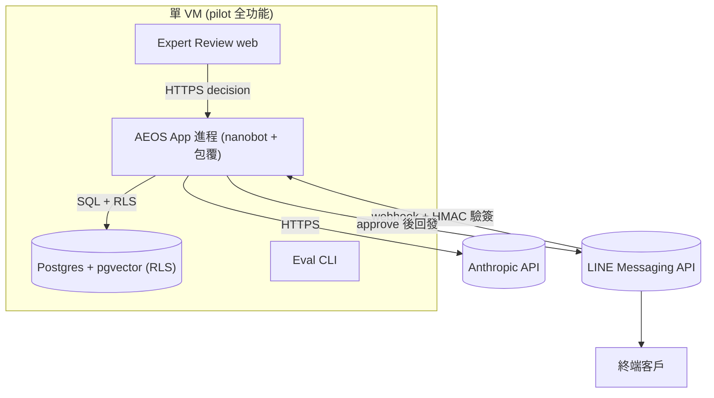
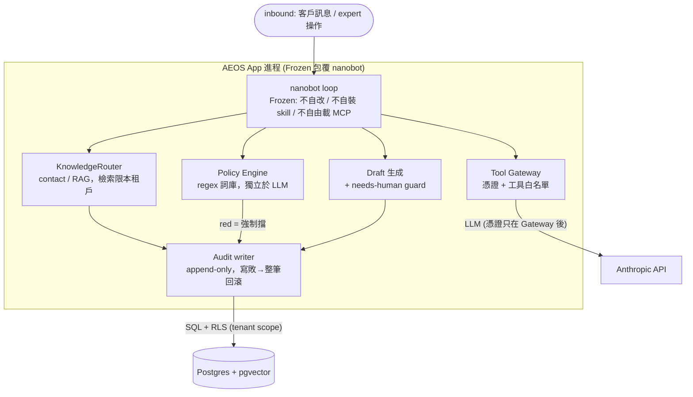
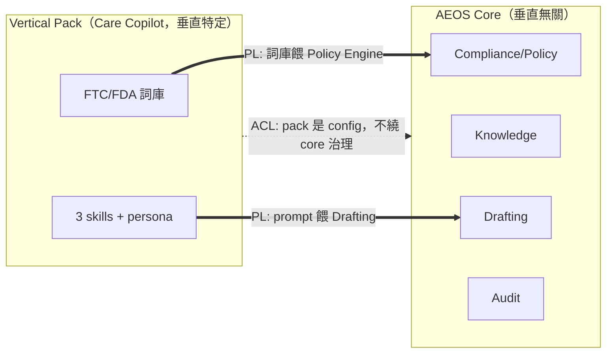
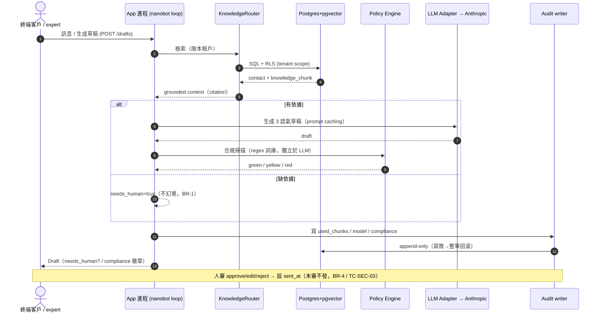
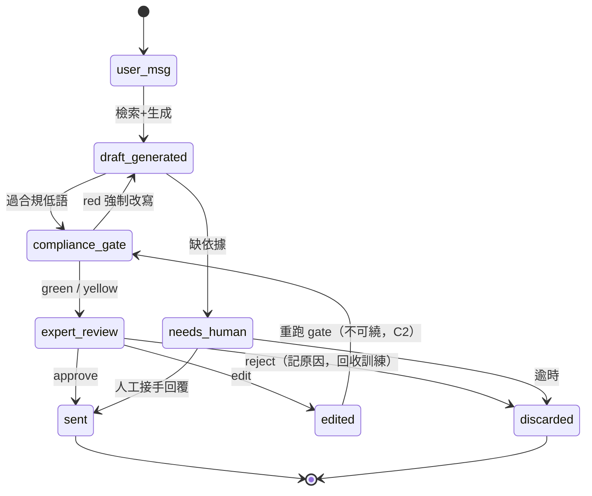
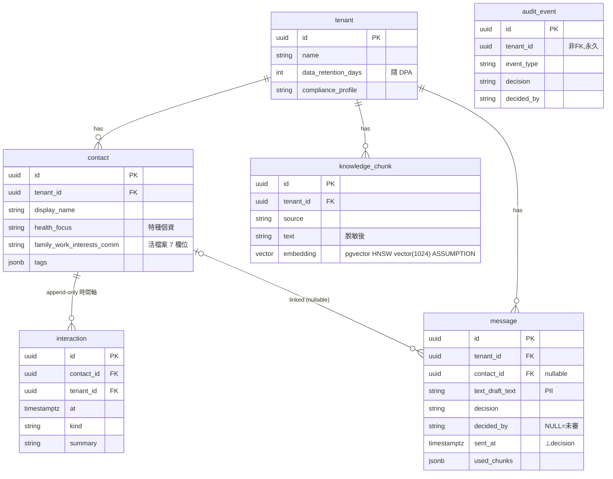
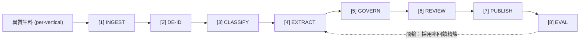
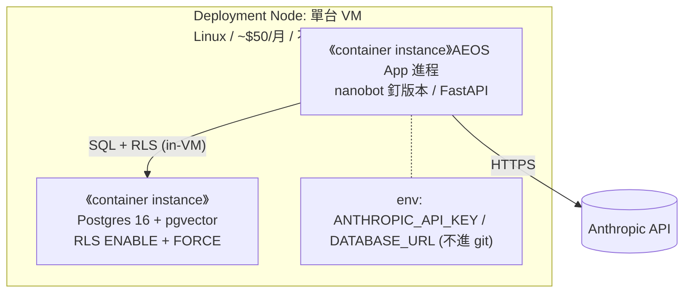

# 架構與設計文件 - care-copilot（最薄切片）

> **版本:** v1.0 | **更新:** 2026-05-29 | **狀態:** 已批准（Gate 4 NFR+ADR baseline frozen）
> **負責人:** ARCH | **審核:** TL | **追蹤:** E-0001~E-0005, ADR-0001~0004
> **來源:** `docs/architecture/c4-care-copilot.md` + `nfr-care-copilot.md` + `knowledge-pipeline.md` + `feasibility-AEOS-x-care-copilot.md` + `docs/data/erd-care-copilot.md`
>
> **與 04 ADR 的邊界**：本檔描述「**是什麼**」（系統長相、Container、資料流）；ADR-0001~0004 描述「**為何選 A 不選 B**」。

---

## 第 1 部分：架構總覽

### 1.1 C4 模型

#### 1.1.0 命名防呆

| 術語 | 指什麼 | 勿混淆 |
| :--- | :--- | :--- |
| **C4 L1–L4** | 架構圖縮放層級 | ≠ feasibility 的「三層堆疊」(L1 nanobot / L2 AEOS / L3 Care Copilot) |
| **C4 Container（L2）** | 可獨立部署/執行的 runtime（本切片：1 VM / 1 app 進程 / 1 DB） | ≠ Python module、≠ pack（pack 是 config 構件非 container） |
| **C4 Component（L3）** | 單一 L2 容器內模組 | 禁止跨容器畫在同一張 L3 |

> **規則**：feasibility 的「三層堆疊（L1/L2/L3）」是**產品分層**，與 C4 縮放層級撞名 → 本檔 C4 章節一律用全稱（System Context / Container / Component），不裸寫 L1–L4 指產品層。

#### 1.1.1 Container 清單

| Container | 類型 | 軌 | 技術 | 何時啟用 | L3 圖 |
| :--- | :--- | :-- | :--- | :---: | :---: |
| **AEOS App 進程**（治理包覆的 nanobot runtime） | 進程 | 🟦 core | Python(nanobot + AEOS harness) | W1 | ✅ 有圖 |
| **Postgres + pgvector** | datastore | 🟦 core | Postgres 16 + pgvector | W1 | 表代圖 → §4.1 ERD |
| **Eval CLI** | CLI（非常駐） | 🟦 core | Python（`aeos-mvg/`） | W1 | 略（CLI 入口） |
| **Expert Review web** | 進程 | 🟨 pack | 最簡 web | W2（虛線） | 略（最笨列表頁） |

- **外部系統清單**：Anthropic API（資料源/LLM，pilot 唯一 egress）；LINE API（推送，W2 手動貼，pilot 不整合）；備份（PITR，§4.3）；雲端 IaaS（單台 VM ~$50/月）。
- **Vertical Pack（Care Copilot）= 宣告式 config 構件，非 container**：領域模型 + FTC/FDA 詞庫 + 3 skills + persona，由 App 進程載入（ADR-0002）。

#### L1 — System Context

**L1 檢查**：邊界內僅一個系統節點 ✓；無 GitHub/IDE ✓；箭頭標協議+動詞 ✓；虛線=W2 未啟用 ✓；外部系統覆蓋資料源(Anthropic)/推送(LINE)/備份(PITR)/IaaS(VM) ✓。

#### L2 — Container（Current / W1）

#### L2 — Container（Target / Future State，全實線）

> **未來 milestone**：W2 啟用 Expert Review web + LINE webhook ingress（HMAC 驗簽）+ approve 後回發。pilot 仍單 VM，**不**水平擴展（規模假設：1 tenant、數名 expert、~100 contacts，過早擴展即浪費）。

#### L3 — Component（zoom: AEOS App 進程，驗 anti-bypass）

**L3 檢查**：標題含父 Container ✓；不含其他 Container 內部（DB schema 改去 §4.1）✓；所有外部憑證在 Tool Gateway 之後，nanobot 本體不持有 ✓；紅燈與跨租戶在進程內就被擋 ✓。

| Component | 責任 | 對映 ADR / 鐵律 |
| :--- | :--- | :--- |
| **Frozen 包覆** | 關閉 nanobot 自改 prompt / 自裝 skill / 自由載 MCP | ADR-0001 / threat-model T-E-03 |
| **Tool Gateway** | 憑證持有 + 工具白名單；不暴露自動發送/改 policy/跨租戶查詢 | OWASP LLM07/08 / 未審自動發=0 |
| **Policy Engine（合規低語）** | regex 詞庫掃 green/yellow/red，獨立於 LLM；red 強制擋 | ADR-0002 pack 詞庫 / 外送踩線=0 |
| **KnowledgeRouter** | 三路：contact(結構化)/RAG(pgvector)/policy；檢索限本租戶 | ADR-0003 |
| **Draft 生成** | grounded + needs-human guard；缺依據標 `[需人工]` | BR-1 |
| **Audit writer** | append-only（used_chunks/model/decision/decided_by/sent_at） | BR-5 / threat-model T-T-02 |

> KnowledgeRouter = retrieval 側（runtime 熱路徑）；**ingest 側**（知識進場治理）走 §4.4 8 階段管線（ADR-0004，W1 只用 3 格）。

#### 1.1.3 C4 審查 Checklist

- [x] L1–L3 各一張圖，一圖一層級
- [x] L3 對應且僅對應一個 Container（App 進程）
- [x] 每個 Container 有 L3 或說明跳過理由（DB→§4.1 ERD；CLI/web→略，附理由）
- [x] Dynamic / Sequence Diagram（§3.4 草稿生成 critical path）
- [x] Deployment Diagram 含 Node 屬性（§5.1）
- [x] 部署拓樸與 `14` Runbook §1、threat-model 信任邊界圖一致（1 VM / 1 app 進程 / 1 DB）

### 1.2 DDD 戰略設計

#### C4 Container ↔ DDD 限界上下文對應

| DDD 限界上下文 | 主要落在 C4 Container | 備註 |
| :--- | :--- | :--- |
| Knowledge（攝取/檢索） | AEOS App 進程（KnowledgeRouter）+ Postgres | core；結構化 contact + doc-RAG |
| Drafting（草稿生成） | AEOS App 進程（Draft 生成） | core 機制 + pack prompt |
| Compliance（合規低語） | AEOS App 進程（Policy Engine） | core 引擎 + pack 詞庫 |
| Review（人類審核） | Expert Review web（W2） | pack |
| Audit/Governance | AEOS App 進程（Audit writer）+ Postgres | core，橫切 |
| Evaluation（B1） | Eval CLI | core |

#### 通用語言（術語詞彙表）

| 術語 | 定義 |
| :--- | :--- |
| **活檔案** | 每客戶結構化 contact（7 欄位）+ append-only 互動時間軸（ADR-0003） |
| **合規低語** | Policy Engine 的 regex 詞庫掃描，輸出 green/yellow/red |
| **Draft Mode** | AI 永不自動發訊，每則由人類審（BR-4） |
| **Frozen Runtime** | 上線配置（prompt+知識快照）凍結，回饋走離線（ADR-0001） |
| **needs_human** | 知識缺依據時草稿標記，不幻覺硬答（BR-1） |
| **Vertical Pack** | 宣告式 config 構件（領域模型+詞庫+skill+persona），非執行路徑（ADR-0002） |

#### 限界上下文圖（Strategic Context Map）

**標記**：PL = Published Language；ACL = Anti-Corruption Layer（pack 不得是另一條執行路徑，ADR-0002）。

#### 1.2.5 DDD 戰術設計

| DDD 元素 | 程式碼位置 | 說明 |
| :--- | :--- | :--- |
| **Entity** | `contact`、`message` | mutable state + identity（per-tenant） |
| **Value Object** | `Interaction`（時間軸條目）、`compliance verdict`(green/yellow/red) | immutable |
| **Aggregate Root** | `contact`（聚合其 interaction timeline） | 一致性邊界 |
| **Domain Event** | `audit_event`（append-only、去識別化、永久） | 業務事實不可變記錄 |
| **Domain Service** | Policy Engine（合規裁決，不屬單一 entity） | 純邏輯、獨立於 LLM |
| **Repository** | KnowledgeRouter（contact/RAG 持久化抽象） | Aggregate 持久化 |
| **Anti-Corruption Layer** | Tool Gateway（隔離 nanobot 與外部憑證/系統） | 隔離外部 schema/憑證 |
| **Specification** | 合規詞庫條目（id + pattern + authority + gate） | 集中業務規則判斷 |

### 1.3 分層架構（Clean Architecture）

| 層 | 程式碼位置 | 職責 |
| :--- | :--- | :--- |
| **Domain Layer** | `policy`（裁決規則）/ contact·message 模型 | 合規規則、活檔案不變式 |
| **Application Layer** | `draft` / `knowledge`(router) / `eval` | Use Cases：草稿生成、檢索、離線評估 |
| **Infrastructure Layer** | `runtime`(nanobot 包覆) / `audit`(DB) / LLM Adapter / pgvector | 外部互動：LLM、DB、RLS |

> Clean Arch 是**邏輯分層**，與單一物理 Container（App 進程）並存 — 不混畫在 L2。

### 1.4 技術選型

| 分類 | 選用技術 | 選擇理由 | 備選方案 | ADR |
| :--- | :--- | :--- | :--- | :--- |
| Agent runtime | nanobot（Python ≥3.11） | Python 同語言 + 原生 MCP/多模型/排程 | pi(TS) / 自建 / LangGraph | ADR-0001 |
| 後端框架 | FastAPI | 與 nanobot 同 Python 棧 | — | ADR-0001 |
| 資料庫 | Postgres 16 + pgvector | 結構化 contact + 向量檢索一庫；別上 Pinecone（過早） | Pinecone | ADR-0003 |
| LLM | Anthropic（opus 草稿 / haiku judge）+ fallback | prompt caching + 模型分層（成本） | OpenAI（抽象層可換） | ADR-0001 |
| 租戶隔離 | Postgres RLS（屬性，非獨立 container） | 鐵律「跨 tenant=0」；FORCE 防 owner 繞過 | app-only 檢查 | ADR-0001 |
| 可觀測性 | stdout structured log + 採用率列表（pilot） | 完整 stack 過早 | Prometheus/Grafana（Phase 2） | — |
| CI/CD | gitleaks pre-commit + CI；釘 nanobot 版本 | secrets 不進 git | — | — |

---

## 第 2 部分：需求摘要

### 功能性需求

- FR-001 知識 ingest（US-0001/UC-1）
- FR-002 草稿生成（US-0003/UC-2）+ 合規 gate（US-0004/UC-4）
- FR-003 訊息入口（W1 手動貼 / W2 webhook，US-0012）
- FR-004 Draft Mode 審核（US-0006/UC-3）
- FR-005 全鏈路稽核（US-0007）
- FR-006 Kill switch（US-0008）
- FR-007 Eval pass rate（US-0011/UC-5）

### 非功能性需求（9 維 NFR matrix）

| 分類 | 需求描述 | 目標值（Pilot） |
| :--- | :--- | :--- |
| Performance | 草稿生成 / 合規檢查延遲 | 草稿 p95 < 5s；合規 regex sidecar < 50ms |
| Availability | 核心可用度 | best-effort，單容器，無正式 SLO；killswitch 觸發後 recovery < N 分鐘（決策人 CEO） |
| Reliability | 草稿失敗處理 | LLM 失敗 → graceful 標 `[需人工]` + fallback_models 重試；無靜默失敗 |
| Scalability | 規模假設 | 1 tenant / 數名 expert / ~100 contacts → 不需水平擴展 |
| Security | auth / 隔離 | LINE webhook HMAC（W2）；secrets 不進 git；DB TLS；tenant_id 強制 RLS |
| Privacy | PII / 保留 | contact 含 PII；保留隨 DPA（匯出 30 天 / 刪除 7 天）；不爬 LINE 歷史 |
| Accessibility | expert 審核台 | WCAG 2.1 AA（pilot 釘，OQ-NFR-1） |
| Auditability | 全稽核 | 每草稿/每訊息 100% 紀錄 used_chunks + model + decision + decided_by |
| Operability | MTTR / killswitch | killswitch 30s 內全停；單一 oncall（CEO） |
| Cost | AI 成本上限 | ≤ $0.30/直銷商/日（prompt caching + 模型分層 + Quota circuit breaker） |

> **鐵律 NFR（blast radius 致命，1 次都不行）**：跨 tenant 違規 = 0、外送踩 FTC/FDA 線 = 0、未審自動發訊 = 0。P0 SLI 偵測來源非人工：跨租戶 = RLS 拒絕事件計數；外送踩線 = 詞庫攔截計數；> 0 自動觸發 killswitch。

---

## 第 3 部分：系統設計

### 3.1 架構模式

- **模式**: 模組化單體（不是微服務）+ 治理包覆的 agent runtime + 事件式 audit。
- **選擇理由**: pilot 規模單體最薄（feasibility §4 / ADR-0001 anti-scope）；未來 11 bounded context 在切片裡是 7 個檔案，等真需要拆再拆。

### 3.3 元件職責

| 元件 | 核心職責 | 技術 | 依賴 |
| :--- | :--- | :--- | :--- |
| runtime（nanobot 包覆） | agent loop + 編排 + Frozen | Python/nanobot | Tool Gateway |
| policy | regex 詞庫掃描 → gate | Python regex | pack 詞庫 |
| knowledge | KnowledgeRouter（contact/RAG）+ ingest | pgvector | Postgres |
| draft | 檢索 + LLM 生成 + needs-human guard | Anthropic SDK | knowledge / LLM Adapter |
| audit | append-only 寫入；失敗即回滾 | Postgres | DB |
| eval | 離線 draft→judge | Python CLI | Anthropic |

### 3.4 關鍵使用者旅程（草稿生成 critical path）

#### Message lifecycle state model

---

## 第 4 部分：資料架構

### 4.1 資料模型（ER 圖，切片 6 表）

> `message` 一張表幹三件事（對話紀錄 + audit log + 訓練素材），消滅資料複製（foundation/02 §3.2）。`contact`(結構化) 與 `knowledge_chunk`(語意檢索) 分開 = ADR-0003 KnowledgeRouter 兩路。`audit_event` 去識別化、append-only、永久、`tenant_id` 非 FK（tenant 刪除後仍留）。

#### KnowledgeRouter 三分類路由

| 查詢 | 路由 | 對象 |
| :--- | :--- | :--- |
| 客戶結構化屬性（年資/標籤/健康關注） | structured query | `contact` + `interaction` |
| 產品/FAQ 自由文本 | RAG | `knowledge_chunk`(pgvector HNSW) |
| 合規規則 | Policy | vertical pack 詞庫（非 DB） |

### 4.2 一致性策略

- **強一致**: tenant scope（RLS）、audit 寫入（寫敗整筆回滾）。
- **最終一致**: 離線改版回饋（approve/edit/reject → 離線精煉，非線上即時學習，ADR-0001）。

### 4.3 資料分類與合規

| 表.欄位 | 等級 | retention |
| :--- | :--- | :--- |
| contact.health_focus | 特種個資（明示同意，可單獨撤回） | 隨 DPA；撤回即停止推論 |
| contact.（其餘）/ interaction.summary | PII | 隨 DPA（匯出 30 天 / 刪除 7 天） |
| message（整 row） | PII（row-level retention） | 隨 DPA（整 row 刪） |
| knowledge_chunk.text | 脫敏後 | 隨 DPA |
| audit_event.*（去識別化） | 非 PII | 永久 |

- **加密**: DB 連線 TLS；secrets 走 env（不進 git）。
- **PITR**: 備份視窗涵蓋 ≥ 7 天刪除緩衝（接 `13` / consent-and-dpa）。

### 4.4 知識攝取治理管線（8 階段，ADR-0004）

> **最小 B1 路徑（W1 只走 3 格）**：`[1]貼上 → [3]全當 Static → draft → [8]eval`。其餘階段被真實需求觸發才加（階段機制通用、不變；每產業差異是各階段 config）。

---

## 第 5 部分：部署與基礎設施

### 5.1 部署視圖（C4 Deployment Diagram）

#### 5.1.1 Pilot Deployment

| 屬性 | 值 |
| :--- | :--- |
| Deployment 模式 | 單 VM in-place（pilot）；升級走 staging 驗證 |
| 高可用 | 無（pilot best-effort；killswitch 保底） |
| Backup | PITR，視窗 ≥ 7 天刪除緩衝；還原實測納 Go-checklist（RPO） |
| 監控 | stdout structured log + 採用率列表 + P0 SLI 自動觸發 |

#### 5.1.3 環境策略

| 環境 | Deployment | 用途 |
| :--- | :--- | :--- |
| Dev | 本機 / `aeos-mvg/` | W1 ingest+draft+eval 離線開發 |
| Staging | 單 VM（同 prod 規格） | nanobot 版本升級驗證 |
| Production | 單 VM（pilot） | Draft Mode 對 1 pilot |

### 5.2 CI/CD 流程

| 階段 | 步驟 |
| :--- | :--- |
| Build | 拉碼 → 安裝依賴（釘 nanobot exact version）→ gitleaks 掃 secret |
| Test | 單元（policy/grounding）→ 紅隊（TC-SEC-01~03）→ B1 eval → `@ironclad` regression |
| Deploy | migration（up + RLS policy 原文）→ 部署 App 進程 → 凍結確認 → 煙霧測試 |

### 5.3 成本估算

| 項目 | 月成本 | 備註 |
| :--- | :---: | :--- |
| VM | ~$50 | 單台，不水平擴展 |
| LLM | ≤ $300（≤ $0.30/直銷商/日） | prompt caching + 模型分層 + circuit breaker |

---

## 第 6 部分：跨領域考量

### 6.1 可觀測性（前置需求，交 `14` 在 P5 實作）

| 維度 | 工具 | 狀態 |
| :--- | :--- | :--- |
| 日誌 | structured，`conversation_id` 串接 | pilot stdout |
| 指標（SLI/SLO） | 草稿延遲 p95 / 成功率、採用率、合規觸發·誤判率、成本/日、跨租戶違規(=0)、外送踩線(=0)、killswitch_active 心跳 | pilot 簡易 |
| 追蹤 | `draft → policy → audit` spans | W2 |
| 告警 | 跨租戶違規 > 0（P0）、外送踩線 > 0（P0）、成本 burn rate（50%/80%）、採用率崩、killswitch 觸發 | pilot |

### 6.2 安全性

威脅模型見 `13_security_and_readiness_checklists.md`（STRIDE + OWASP LLM Top 10 + 三鐵律攻擊路徑）；認證 = tenantBearer + RLS；機密 = env + gitleaks；prompt injection 四層縱深防禦。

---

## 第 7 部分：風險與演進

### 7.1 風險登記（架構面）

| 風險 | 可能性 | 影響 | 緩解策略 |
| :--- | :--- | :--- | :--- |
| 跨租戶資料外洩（RLS 失效） | 低 | 致命（P0） | RLS + app 層雙重；migration 後自動跑 TC-SEC-01；違規即停 |
| nanobot 自我擴展未凍結 → 行為漂移 | 低 | 高 | Frozen 包覆強制關閉（ADR-0001）；配置快照 diff |
| 知識檢索缺漏 → 幻覺 | 中 | 高 | grounding + needs-human guard + 強制 citation |
| AI 成本爆量 | 中 | 中 | Quota + circuit breaker 降階模型 + burn rate alert |
| 裸用 nanobot 跑生產 | 低 | 致命 | 治理包覆列 design driver P0 |
| 核心被垂直需求污染 | 中 | 高 | 垂直特定一律進 vertical pack（ADR-0002） |

### 7.2 演進路線

| Phase | 範圍與目標 |
| :--- | :--- |
| W1（MVP） | ingest + draft + eval（離線打 B1，不等 LINE） |
| W2 | webhook + 審核台 + 回發 + killswitch + 全鏈路 |
| W3–W6 | 真 pilot 上線、量採用率、W6 Go/Kill |
| Phase 2（僅 Go 才做） | 自動發 canary、第 2 租戶、LLM PII token 化、secret 自動輪替、完整 observability stack |

---

## 第 8 部分：模組詳細設計

詳見 [`07_module_specification_and_tests.md`](./07_module_specification_and_tests.md)。

### NFR 實現

- 性能: prompt caching + 模型分層（haiku 分流 / opus 草稿）；regex sidecar < 50ms。
- 安全: RLS FORCE + Tool Gateway 工具白名單 + Policy Engine 獨立於 LLM。
- 可擴展: 切片不需（規模假設）；介面預留（記憶匯出 / 換通道 B3）。

---

## 變更紀錄

| 版本 | 日期 | 變更 |
| :--- | :--- | :--- |
| v1.0 | 2026-05-29 | 依模板 05 v2.0 整合 c4 + nfr + knowledge-pipeline + feasibility + erd 實例化 |

---

## 附錄：跨文件一致性檢查表

| 異動類型 | 應同步更新 |
| :--- | :--- |
| 新增 Container | `14`（部署） |
| 新增 module | `07`（模組規格） |
| 新增外部系統 | `06`（API）、`13`（安全）、`14`（部署） |
| 變更 protocol | `06`、`13`、`14` |
| 變更 DDD 限界上下文 | `02`（PRD Epic）、`07`（模組規格） |

> **鐵律**：05 是架構契約 — 任何模組在 05 沒出現等於不存在。本檔變更須回寫 `docs/architecture/` frozen 文件並走 DR。
