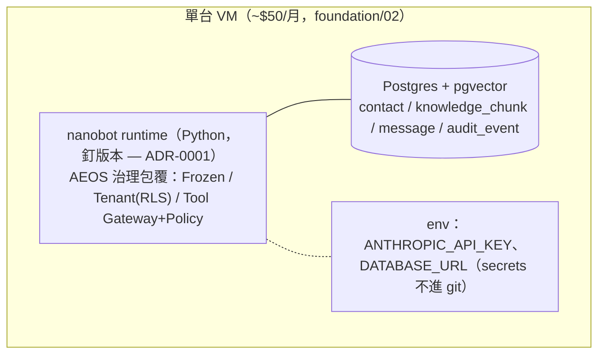
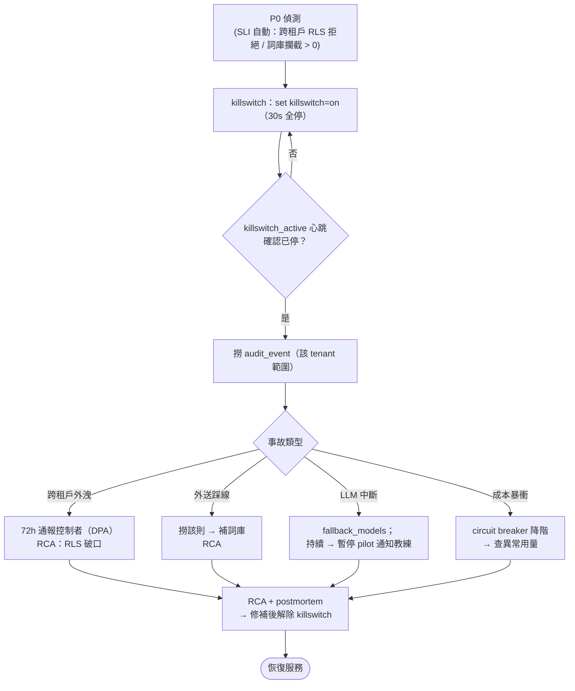

# 部署與運維指南 - care-copilot（Pilot）

> **版本:** v1.0 | **更新:** 2026-05-29 | **狀態:** 草稿
> **負責人:** SRE（pre-seed = CEO 唯一 oncall） | **審核:** TL + OPS | **適用範圍:** 上線 + 運維（對應 QG-G3/G4）
> **來源:** `docs/ops/runbook-care-copilot.md` + `docs/ops/release-readiness-care-copilot.md` + `docs/architecture/nfr-care-copilot.md`

---

## 1. 部署架構

```text
Dev (本機 aeos-mvg/) → Staging (單 VM 同規格) → Production (單 VM, pilot)
```



### 基礎設施元件

| 元件 | 用途 | 技術選型（pilot） |
| :--- | :--- | :--- |
| 應用伺服器 | 核心應用託管 | 單 VM 上的 FastAPI + nanobot 進程（**不上 K8s**，過早） |
| 資料庫 | 結構化 contact + 向量檢索 | Postgres 16 + pgvector（HNSW） |
| LLM | 草稿 / judge | Anthropic（opus / haiku）+ fallback_models |
| 監控 | 健康檢查與告警 | stdout structured log + 採用率列表（pilot；完整 stack 過早） |

> **凍結檢查**：部署前確認 nanobot 自我擴展（自裝 skill / 自改 prompt / 自由載 MCP）已關（ADR-0001）。
> **版本**：nanobot 釘 exact version；升級走 staging 驗證。

---

## 2. CI/CD 流水線

| 階段 | 步驟 |
| :--- | :--- |
| **建置** | 拉碼 → 安裝依賴（釘 nanobot exact version）→ gitleaks 掃 secret → 產出 artifact |
| **測試** | 單元（policy/grounding）→ 紅隊（TC-SEC-01/02/03）→ B1 eval → `@ironclad` regression → 草稿 p95 < 5s perf case |
| **部署** | migration（up + RLS policy 原文）→ 部署 App 進程 → 凍結確認 → 煙霧測試關鍵 endpoint → 監控錯誤率/延遲 |

---

## 3. 部署檢查清單

> 📎 分工：`13 §G` = pre-deploy 整體就緒（對應 QG-G3）；本節 = deploy 動作 checklist；§5 = post-deploy 持續監控。

### 部署前

- [ ] QG-G3 已通過（critical=0 且 high≤2，見 `13 §F`）
- [ ] 所有測試通過（單元 / 紅隊 / B1 eval / `@ironclad`）
- [ ] DB migration 準備好（含 RLS policy 原文 + `.down.sql` reverse-order；dry-run on staging：上→下→上）
- [ ] 回滾計畫已記錄並演練 ≥ 1 次（§6；pilot 主回滾 = killswitch）
- [ ] 監控告警已配置（§5）
- [ ] nanobot 凍結確認 + Tool Gateway 白名單無自動發送/改 policy/跨租戶查詢
- [ ] 團隊已通知（pilot = 通知教練）

### 部署中

- [ ] 監控部署進度 / 驗證健康檢查 / 檢查應用日誌 / 驗證關鍵功能（草稿生成）

### 部署後

- [ ] 煙霧測試通過 / 錯誤率正常 / 採用率列表可讀 / 文檔已更新

---

## 4. 部署策略

| 策略 | 適用場景 | 回滾時間 |
| :--- | :--- | :--- |
| **單 VM in-place** | pilot 唯一策略（單 tenant 規模） | killswitch < 30s |
| ~~Blue-Green / Rolling / Canary~~ | **Out of Scope（pilot）** | — |

> pilot 對 1 個 pilot 直接上 **Draft Mode**（人類審每一則 = human-in-loop，無 canary 需求，單 pilot 規模）。Rollback 主手段 = killswitch。

---

## 5. 監控與告警

### 關鍵指標（SLI / SLO，pilot best-effort）

| SLI | 目標 | Alert |
| :--- | :--- | :--- |
| 草稿生成成功率 | best-effort | 連續失敗 → 通知 oncall |
| 草稿延遲 p95 | < 5s | 持續 > 10s 告警 |
| 合規 regex sidecar | < 50ms | — |
| **跨租戶違規數** | **= 0** | **> 0 → P0 即停（自動 killswitch）** |
| **外送踩線數** | **= 0** | **> 0 → P0（自動 killswitch）** |
| 注入偵測（`prompt_injection_pattern_detected`） | 標記不阻擋 | 趨勢異常 → 人工複查 audit（「忽略」也是 action） |
| 成本 / 直銷商 / 日 | ≤ $0.30 | 超 quota → circuit breaker 降階；burn rate 50%/80% alert |
| 草稿採用率 | 監控趨勢 | 崩（< 40%）→ 觸發 Kill 重評 |
| `killswitch_active` 心跳 | 觸發後 30s 內無新草稿 | 自動 assert（防假停） |

> **P0 SLI 偵測來源非人工**：跨租戶 = RLS 拒絕事件計數；外送踩線 = 詞庫攔截計數。

### 告警規則

| 名稱 | 條件 | 嚴重程度 | 通知方式 |
| :--- | :--- | :--- | :--- |
| 跨租戶違規 | count > 0 | P0 | 自動 killswitch + page oncall |
| 外送踩線 | 詞庫攔截異常 / count > 0 | P0 | 自動 killswitch + page oncall |
| 成本 burn rate | 日預算 50% / 80% | Warning | 告警 oncall |
| 採用率崩 | < 40% | Warning | 觸發 Kill 重評 |

---

## 6. 回滾流程

### 6.1 自動回滾觸發（pilot 主手段 = killswitch）

| 條件 | 閾值 | 處置 |
| :--- | :--- | :--- |
| 跨租戶違規 | count > 0 | killswitch（30s 全停）+ page oncall |
| 外送踩線 | 詞庫攔截 > 0 | killswitch + page oncall |
| 成本暴衝 | 超 quota | circuit breaker 降階 → 仍超 → killswitch |

### 6.2 Kill Switch（鐵律，第一週就有）

- 機制：單一 flag（DB 或 env）→ runtime 每步讀取，**30s 內停止產草稿與回發**。
- 操作：`set killswitch=on` → 驗證 `killswitch_active` 心跳 + 無新草稿。
- 觸發時機：跨租戶外洩、外送踩線、成本失控、品質崩。

### 6.3 Data 層回滾（DB migration）

- [ ] `<NNNN>_<name>.up.sql` / `.down.sql`（golang-migrate 風格）；down 已驗 reverse-order drop
- [ ] 結構化 contact 若從非結構化來源遷入 → 上線走**雙寫 ≥ 1 release** 再切讀
- [ ] 不可逆變更（drop column/table）須預先標記 point-of-no-return
- [ ] 驗證資料完整性（row count、checksum）

### 6.6 對應文件更新（回滾後）

- [ ] 對應 ADR 標 `superseded` / `reverted`；DR 重新評估
- [ ] post-mortem 72 小時內

---

## 7. Runbook（P0 first-responder，CEO 深夜可照做）

每條 P0 標準 5 步：**detect → killswitch(`set killswitch=on`) → 撈 audit_event(該 tenant 範圍) → 通報 → RCA**。



### Incident 對照表

| 事故 | 處置 |
| :--- | :--- |
| 跨租戶外洩 | killswitch → 稽核範圍 → 72h 通報控制者 → RCA（RLS 破口） |
| 外送踩線 | killswitch → 撈該則 audit → 補詞庫 |
| LLM API 中斷 | fallback_models；持續中斷 → 暫停 pilot 通知教練 |
| 成本暴衝 | circuit breaker 降階；查異常用量來源 |
| 資料復原 | 最壞 15 分鐘內（RTO）；從 PITR 備份還原 |

### Runbook 範本骨架

```markdown
# 服務 Runbook: care-copilot
## 服務概覽: 單 VM / nanobot+Frozen / Postgres+pgvector；依賴 Anthropic API
## 部署: 釘 nanobot 版本；migration up + RLS；凍結確認；健康檢查端點
## 監控: §5 SLI；P0 自動 killswitch；log to stdout + 採用率列表
## 故障排除: §7 P0 5 步；緊急聯絡人 = CEO（唯一 oncall）
```

---

## 8. 成本與容量

| 項目 | 月成本 | 備註 |
| :--- | :---: | :--- |
| VM | ~$50 | 單台，不水平擴展（規模假設：1 tenant / ~100 contacts） |
| LLM | ≤ $300 | ≤ $0.30/直銷商/日；prompt caching + 模型分層 + circuit breaker |

---

## 變更紀錄

| 版本 | 日期 | 變更 |
| :--- | :--- | :--- |
| v1.0 | 2026-05-29 | 依模板 14 從 runbook + release-readiness + nfr 實例化；pilot 回滾主手段 = killswitch |
