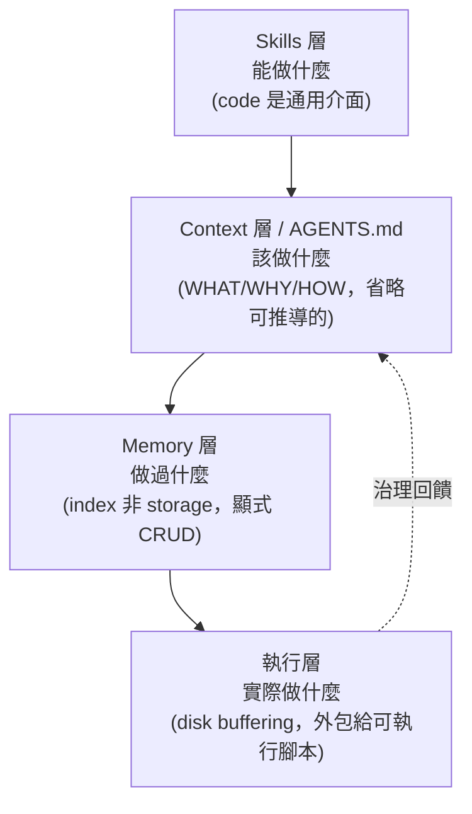

# KB 00 — Design Philosophy & 2026 Paradigm Alignment

> **📋 Status**: reference · 設計哲學序章（非操作型 catalog，不被 skill 熱路徑載入）
> **🗓 Last updated**: 2026-05-29
> **👤 Owner**: DevTeam Harness
> **🔖 Version**: v1
> **🔗 Related**: `.claude/CLAUDE.md`（WHAT/HOW 憲法）· `_registry.json`（枚舉真相）· `voice-profiles.md` · KB-01 · KB-06~11

---

## 📋 Executive Summary

> [!TIP]
> **TL;DR (30s)**：本文件回答 harness 的 **WHY**（CLAUDE.md 只講 WHAT/HOW）。結論反直覺但站得住：**AEOS 已經獨立收斂到 2026「post-MCP / skills-first / 無向量記憶 / AGENTS.md-as-context」設計範式的教科書實作**，四理論達成度 4/4。因此「導入新架構」多半是把既有東西換名重造，且天真導入會主動破壞 AEOS 自己的 no-copy / anti-bloat / deterministic 原則。本文件固化此判斷 + 被否決的提案，防未來重提。

| 維度 | 摘要 |
|:---|:---|
| **目標** | 把 harness 的隱性設計意圖顯性化；對齊 2026 範式；誠實盤點真實缺口 |
| **範圍** | harness 自身設計哲學 — 不是任何 product feature 的規範 |
| **狀態** | ✅ reference（穩定） |
| **下一步** | 真實缺口見 §5（多為 defer）；被否決提案見 §6（勿重提） |

---

## 🎯 1. 目的與使用方式

| 問題 | 答案 |
|:---|:---|
| **這份文件是什麼** | harness 的設計理由書（WHY 層）。把「為何這樣設計」寫下來，補 `CLAUDE.md`（WHAT/HOW）與 KB-01~13（操作 catalog）之間缺的一層 |
| **誰讀** | 想動 harness 架構的 contributor（含未來的 Claude）；提「導入某某新範式」前先讀本文件 |
| **何時讀** | 評估架構級變更、引入外部範式、或質疑「為何不加 X」時 |
| **誰不讀** | 跑日常 spec 產出的 driver skill / persona agent — **本檔不進熱路徑** |

> [!IMPORTANT]
> **本檔不被任何 skill 的 `references:` 欄位列入，不在 session 開場自動載入。** 這是刻意的 —— 把一份談「反 context bloat」的文件塞進每次開場的 context，本身就是 bloat（見 §2 理論四與 §6 被否決提案的內部矛盾分析）。

---

## 🧭 2. 2026 設計哲學（提煉）

來源：四篇 aihao.tw 文章（見 §8）。它們不是四個獨立技巧，而是一個互相鞏固的世界觀。

> [!NOTE]
> **核心論斷（一句）**：Agent 的瓶頸不是智力或工具豐富度，而是**上下文精度與資訊治理**。

四層遞迴結構 —— 每層回答一個不同的問題：

| 理論 | 主張 | 反對 | 金句 |
|:---|:---|:---|:---|
| **① Skills > Agents** | agent=OS、skill=app、code 是通用介面；progressive disclosure 讓數千 skill 共存 | 為每領域造獨立通用 agent | "Code is All You Need" |
| **② Post-MCP（Skills vs MCP）** | code-driven 勝 schema-driven；disk buffering 換 98% context 減少 | MCP 協議層開銷、連線即載入全部工具定義 | "Most MCPs are just marketing checkboxes." |
| **③ AGENTS.md 上下文工程** | 只記「code 推導不出的」（WHAT/WHY/HOW）；指令越多反而越糟 | 複製 README / 目錄樹；tool-mention curse（提到的工具被濫用 ×160） | "If agents can discover it by reading code, omit it." |
| **④ Memory 無向量** | 記憶是治理問題（保留/合併/淘汰），是 index 非 storage；顯式 CRUD | 把向量檢索當通用記憶解；為百萬級規模過度設計 | "Writing pollution is worse than retrieval errors." |

---

## 🔍 3. AEOS × 範式對照表（核心節）

逐理論對應 AEOS 實作，**每格附可查證的檔案證據**。

| 2026 理論 | AEOS 實作 | 檔案證據 | 達成 |
|:---|:---|:---|:---:|
| **① Skills-first** | 11 driver skills + router Phase DAG（P0–P5 + 7 gates），skill 互相 dispatch | `.claude/skills/devteam-*/SKILL.md`、`devteam-router`（DAG 路由） | ✅ |
| **② Post-MCP / code-driven** | 純 skill-based，零 MCP server；critique agent 只用 `Read/Grep/Glob` 直接讀檔，無協議層 | `_registry.json` `_README`：「JSON 而非 YAML：零依賴，Stop hook 環境必能 parse」；persona agent frontmatter `tools: Read, Grep, Glob` | ✅ |
| **③ AGENTS.md / WHAT-WHY-HOW** | `CLAUDE.md` 是顯式憲法（指令/DAG/Lane 機制/scope 邊界），不複製可推導內容 | `.claude/CLAUDE.md` §Scope 邊界明寫「harness 不做什麼」（WHY 層） | ✅ |
| **③ 反膨脹 / anti-bloat** | voice-profiles **主動做減法**：vocab 預算 ≤5、Substance>voice、No-cosplay；載入只讀對應段 | `voice-profiles.md` §Anti-caricature 護欄 1–5 + §載入 protocol「其他段不讀，節省 token」 | ✅ **比天真導入更克制** |
| **③ no-copy / 防漂移** | 枚舉事實單一真相，KB 一律 cross-ref 不複製；linter 機械驗 | `_registry.json` `_README`：「避免 KB-to-KB 漂移 HB-1」；KB-01 §Crosswalk「不複製清單（避免漂移）」 | ✅ |
| **④ Memory 無向量 / index 非 storage** | `adr-ledger.json` = 跨 feature 決策 index（flat array + tags + related_kb + supersedes/extends），零向量 | `.claude/context/devteam/adr-ledger.json`（4 筆 ADR，含 `extends`/`supersedes` 鏈）+ `indexes/*.json` | ✅ |
| **④ 顯式生命週期 / 高寫入門檻** | 寫入只在 freeze ceremony / 業主裁決；cascade_policy 預設 manual_confirm | `state.json` `cascade_policy: manual_confirm`；DR 範本 §Approval「業主裁決」閘 | ✅ |
| **⑤ 心智範本五層** | 已分散實作（見 §4） | 見 §4 | ✅ |

> [!IMPORTANT]
> **達成度 4/4（+ 心智範本層）。** 四篇文章描述的範式，AEOS 大多在它們發表前就已實作。本對照不是「待辦清單」，是「驗證 harness 設計健全」的證據。

---

## 🧩 4. 心智範本五層在 AEOS 的分散實作

nuwa / zhangxuefeng「心智範本」= 五層認知 OS。關鍵發現：**AEOS 早已實作這五層的「深度」，只是分散在不同檔案、用不同名字**。

| nuwa 五層 | AEOS 對應 | 檔案證據 |
|:---|:---|:---|
| **mental_models**（思維框架） | KB-06~11 各領域決策 catalog | `06_quality_attributes`（NFR）· `09_observability` · `10_resilience_patterns` · `08_api_design` · `11_data_and_stack` |
| **decision_heuristics**（快速判斷規則） | persona agent 的「常見 blocker 範例」段 | `devteam-arch-persona.md` §Arch 常見 blocker 範例（如「Failure mode 全列 log+retry（沒思考）」） |
| **該盯什麼**（注意力分配） | KB-01 cheat sheet「最該盯的一件事」欄 | `01_role_responsibilities.md` §12 Personas Cheat Sheet |
| **expression_dna**（怎麼說） | voice-profiles 的 vocab/tone/frame/example | `voice-profiles.md` 12 persona 段 |
| **honest_boundaries**（不判斷什麼） | persona agent 的「視角邊界 / 不關注」段 | `devteam-arch-persona.md` §視角邊界「不關注：模組內部設計（→sd）、商業 KPI（→pm）、測試覆蓋（→qa）」 |

> [!TIP]
> **洞察**：zhangxuefeng 的真正貢獻不是「加層」，是「**心智是連貫的組裝**」。AEOS 用 `_registry.json` 把這些分散層**綁定**（persona ↔ driver ↔ product_role ↔ KB），用 cross-ref 而非複製達到同效果 —— 拿到「連貫」卻不付「膨脹」的代價。把五層複製成一個厚檔案，反而會丟掉 AEOS 的 no-copy 優勢（見 §6）。

---

## 📌 5. 真實缺口盤點（誠實、小）

經 forum 辯論後仍站得住的缺口 —— 都不大，多數 defer。

| # | Gap | 理論依據 | 為何小 | 候選解 | 裁決 |
|:---|:---|:---|:---|:---|:---:|
| G-1 | 每 persona 的「心智」散在 4+ 檔案，無單一可讀視圖 | ⑤ 連貫組裝 | `_registry.json` 已綁定，只是無 human-facing 彙整視圖；日常運作不需要 | 若要做：純 cross-ref 指標的「心智索引」（**禁複製內容**），linter 可驗 | ⏳ defer（無痛點證據前不做） |
| G-2 | catalog 覆蓋無回饋：不知哪些 KB 段落從未被任何 ADR 引用 | ③ 治理 | `indexes/catalog_usage.json` 已記「正向」用量；缺的是「反向」gap 偵測 | linter 加一條：列出零引用 KB 段落 | ⏳ defer（既有 backlog `project_harness_backlog.md`） |
| G-3 | Lane A→B 自動升級僅「提示」，需業主手動 confirm | ④ 顯式裁決 | 這其實**符合** deterministic 設計（自動流轉會繞過裁決閘），不算純缺陷 | 維持現狀；僅在 conflicts 暴增時檢討 | ✅ won't（刻意保留人類閘） |

> [!NOTE]
> 所有缺口都連回 `project_harness_backlog.md`（harness TODO 追蹤）。**沒有任何缺口需要架構級重構** —— 這正是 §3 達成度 4/4 的推論。

---

## ❌ 6. 被否決的提案與理由（ADR 式「我們沒做什麼」）

> [!IMPORTANT]
> 此節記錄 2026-05-29 一場 forum（設計 agent vs Linus 式紅隊 premortem）的收斂結論。目的：**deterministic、可審、防未來重提**（這本身就是理論④「治理優於規模」的正確示範）。

**原始需求**：把四篇文章 + nuwa 心智範本「導入 AEOS 以新型態創新架構」。
**設計 agent 提案三招** → **紅隊全砍** → **業主拍板：只做本對照文件**。

| 提案 | 一句話 | 否決理由 | 裁決 |
|:---|:---|:---|:---:|
| **Move 1**：persona 升五層認知範本 | 讓 critique 靠「決策框架」而非「詞彙」區分 | (a) 深度早已存在於 KB-06~11 + blocker 範例（§4），是換名重造；(b) `decision_heuristics` 字面複製 KB-10/06 → 製造 KB 漂移，違反 HB-1；(c) persona 從輕量 voice 變厚重五層 = context bloat，**違反所引文章③自己的告誡（內部矛盾）** | ❌ 砍 |
| **Move 2**：通用 mind-forge（任意專家→可插拔 persona） | 把公司 senior 灌成 AI 員工 | (a) 與 spec-harness 使命無關（另一個產品）；(b) 從零散素材提煉「決策框架」= 不可驗證的幻覺 persona，正踩 voice-profiles No-cosplay 護欄；(c) 進 freeze gate 會用幻覺 block 真決策 | ❌ 砍 / 若要做則獨立立項 |
| **Move 3**：跨 session 自動制度記憶 | harness 跨 feature 自動學習 | (a) session 孤立是**刻意的** deterministic/git-friendly 設計，非缺陷；(b) 自動寫入 = 污染溫床，踩文章④自己的「寫入污染比檢索失敗更糟」；(c) 繞過業主逐項裁決閘 | ❌ 砍自動部分；要做就強化既有 `adr-ledger.json`（手動、可審） |

> [!WARNING]
> **共通教訓**：天真套用 2026 論文詞彙，恰好會違反那些論文自己最在意的原則（反膨脹、反污染）。AEOS 已內化這些原則 —— 任何「導入」提案必須先證明它**不**破壞 no-copy / anti-bloat / deterministic 三條底線。

---

## ⚖️ 7. Lane-by-Lane 風險原則（前置設計準則）

forum 雙方都漏掉的信號：**幻覺 / 鑄造 persona 的可接受度，隨 Lane 不同**。記為未來若做可插拔專家的前置原則。

| Lane | 性質 | 是否 block 決策 | 容不容得下「鑄造/實驗性 persona」 |
|:---|:---|:---:|:---|
| **A — Critique Pipeline** | freeze gate / `/devteam-review` | ✅ 會 block | ❌ 零容忍 —— 幻覺 persona 不可阻擋真實架構決策 |
| **B — Forum-Lite** | 跨領域衝突收斂 | ⚠️ 影響裁決 | ❌ 高風險 —— 影響收斂方向 |
| **C — Roundtable** | 探索性對話，業主只讀 MoM | ❌ 不 block | ✅ **可接受** —— 探索性輸入、低風險、業主有 MoM 過濾 |

> [!TIP]
> **準則**：若未來真要做「公司 senior AI 分身」，正確切點是 **Lane C 限定的探索性 persona**（標 exploratory，永不進 Gate），用 Lane 隔離化解 §6 Move 2 的幻覺風險。在此之前，不做。

---

## 🔗 8. 參考來源

| # | 來源 | 類型 | 可信度 |
|:---|:---|:---|:---:|
| ① | [Post-MCP Era: Skills vs MCP](https://blog.aihao.tw/2026/03/12/post-mcp-era-skills-vs-mcp/) | 部落格（原文抓取） | 高 |
| ② | [別建 Agent，要建 Skill](https://blog.aihao.tw/2026/02/24/dont-build-agents-build-skills/) | 部落格（原文抓取） | 高 |
| ③ | [AGENTS.md 研究與實踐](https://blog.aihao.tw/2026/05/03/agents-md-research-and-practices/) | 部落格（原文抓取） | 高 |
| ④ | [Agent Memory 不用向量](https://blog.aihao.tw/2026/04/28/agent-memory-no-vector/) | 部落格（原文抓取） | 高 |
| ⑤ | [zhangxuefeng-skill](https://github.com/alchaincyf/zhangxuefeng-skill) | GitHub repo（心智範本實例） | 高 |
| ⑥ | [nuwa-skill](https://github.com/alchaincyf/nuwa-skill) | GitHub repo（元框架 / 五層骨架） | 高 |
| ⑦ | [steve-jobs-skill](https://github.com/alchaincyf/steve-jobs-skill) | GitHub repo（填充範例） | 高 |

---

## 🔗 Cross References

- 系統憲法（WHAT/HOW）：[`.claude/CLAUDE.md`](../.claude/CLAUDE.md)
- 枚舉事實單一真相：[`_registry.json`](./_registry.json)
- 語言指紋 + anti-caricature 護欄：[`voice-profiles.md`](./voice-profiles.md)
- 角色 cheat sheet（「最該盯一件事」）：[`01_role_responsibilities.md`](./01_role_responsibilities.md)
- 決策 index（no-vector memory 證據）：[`.claude/context/devteam/adr-ledger.json`](../.claude/context/devteam/adr-ledger.json)

---

**End of KB 00**

> 給 contributor：提「導入某某新範式」前，先讀 §3（多半已實作）+ §6（多半已否決）。先證明不破壞 no-copy / anti-bloat / deterministic 三底線，再談。
