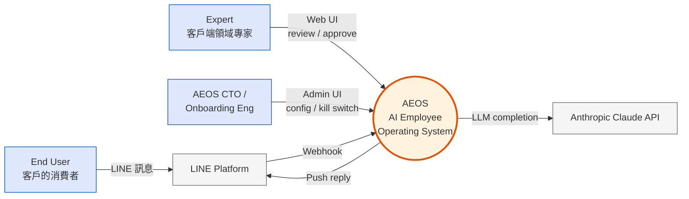
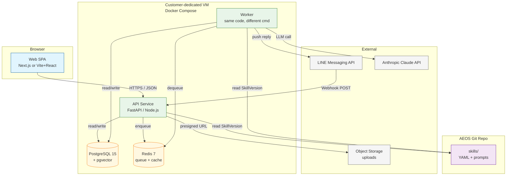
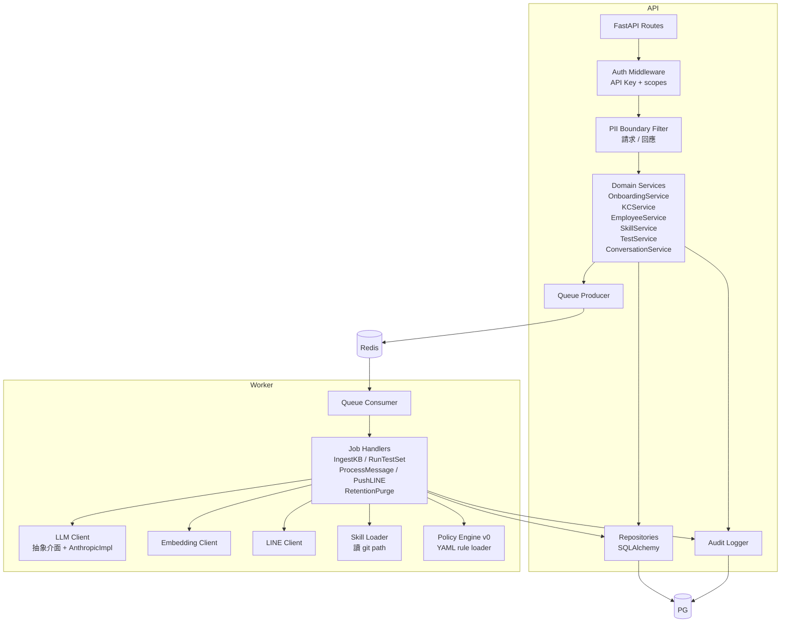

# AEOS System Architecture Document v0.1

> Phase 1 (0–3 個月) 的 C4 Level 1 + Level 2 架構。詳細 domain 切分見 `02-product-architecture.md`；本文件聚焦**可部署的最小架構**。

## 1. Quality Attributes（必須優先順序）

1. **Auditability**（每動作可追溯）
2. **Reversibility**（可一鍵回滾、一鍵停機）
3. **Time-to-deliver**（90 天必須上線）
4. **Operational simplicity**（單人可維運）
5. **Cost efficiency**（單 tenant 月成本 < 月費 30%）

明文不在 Phase 1 優化的（priority < 5）：throughput, multi-region, sub-second latency。

## 2. C4 Level 1 — System Context



**System Boundary**：AEOS 自己擁有 web 後台、API、Worker、PG、Redis；對外依賴 LINE 與 Anthropic。

## 3. C4 Level 2 — Containers



### 3.1 Container 職責

| Container | 職責 | Tech | 進程數 |
|---|---|---|---|
| **Web SPA** | Expert / CTO 後台介面；KC 編輯、Test Set、Draft Inbox、Admin | React 18 + TypeScript（Vite）+ Tailwind + shadcn/ui | 0（靜態托管） |
| **API** | REST API、LINE webhook 入口、API key 認證、PII pseudonymize at boundary、audit log emit、enqueue 給 Worker | FastAPI（Python 3.12）or Node.js（TS） | 1 (per VM) |
| **Worker** | 長任務：KB ingest、Test run、LLM 對話處理、LINE push、retention purge | 同 API 程式碼，不同 entrypoint | 1–2 (per VM) |
| **PostgreSQL** | 主資料庫（schema 見 `db-schema.md`）、pgvector 做 KC 檢索 | PostgreSQL 15 + pgvector ext | 1 |
| **Redis** | 任務 queue（單 list-based queue + DLQ），session/conversation hot cache | Redis 7 | 1 |
| **Skill Git Repo** | Skill source of truth；Worker 直接從 file system 讀（CI 部署時同步到 VM） | git + YAML + Markdown | （read-only mount） |

**選 Python 還是 Node？** 待 Week 1 Day 1 決定 — 看隊員 A 主力語言；CTO 兩種都 OK。本文件後續預設 Python（FastAPI + Pydantic + SQLAlchemy + Celery-Redis or RQ），若決議 Node 則對應替換。

### 3.2 部署拓樸（per tenant）

```
[Cloudflare DNS] → [VM (2 vCPU, 8 GB RAM, 100 GB SSD)]
                       ├── nginx (反代 + TLS)
                       ├── api (gunicorn x 2)
                       ├── worker (1 process)
                       ├── postgres (volume mount)
                       └── redis (volume mount)
```

**Single VM** = 簡單、可控、出事影響範圍小。客戶數 ≥ 5 → 寫 ADR-0007 評估 multi-tenant。

## 4. C4 Level 3 — Component（API + Worker 內部）



## 5. Cross-Cutting Concerns

### 5.1 Auth & Tenancy
- API Key + scopes（用 bcrypt hash 存 DB；header `X-API-Key`）
- Phase 1 每 VM 一個 tenant，但 code 仍透過 `tenant_id` filter（為 Phase 2 預留）
- Expert / CTO web 後台用 session cookie + CSRF token

### 5.2 Audit
- 任何 state transition → `AuditEvent`（append-only，trigger 擋 UPDATE/DELETE，見 `db-schema.md`）
- Audit log 永久保留；其他資料 90 天

### 5.3 PII
- API 邊界層：request body 進 → 跑 PII detector → 偵測到 → 取代為 token + 寫 `encrypted_pii`
- Response 出去前不還原（除非 admin 授權）
- 詳見 `ADR-0005`

### 5.4 Observability
- Phase 1：structured logs (JSON) → stdout → docker logs；錯誤 → Sentry self-host or Sentry SaaS free tier
- 指標：Prometheus exporter（不另起 server，靠 endpoint `/metrics`）
- Phase 2：加 Grafana / Loki

### 5.5 Secret Management
- `.env` per VM；用 SOPS + age 加密 in repo
- LLM API key、LINE channel access token、PII vault key 全走 env，code 內 import os.environ
- Rotation 政策：90 天，手動

### 5.6 Cost Tracking（Phase 1 簡版）
- 每次 LLM call 記 `tool_invocation.cost_token`
- 每日 cron 統計、產 email report
- Phase 2 才做 per-tenant attribution dashboard

## 6. Key Technology Decisions（從 ADR）

| 領域 | 決策 | ADR |
|---|---|---|
| LLM | Claude Sonnet 4.6 主力 + Haiku 4.5 高頻 | ADR-0001 |
| Agent Runtime | 包 nanobot，自寫 Governance Layer | ADR-0002 |
| Skill 儲存 | Git monorepo + YAML | ADR-0003 |
| 部署 | 單租戶 SaaS per VM | ADR-0004 |
| PII / Retention | Pseudonymize + 90 天 + audit 永久 | ADR-0005 |
| 後端語言 | Python 3.12 / FastAPI（暫定，Week 1 確認） | （待 ADR-0011） |
| Frontend | React 18 + Vite + Tailwind + shadcn/ui | （待 ADR-0008） |
| Queue | Redis list + Python RQ（or Celery） | （inline，後續可寫 ADR） |
| DB | PostgreSQL 15 + pgvector | （inline） |

## 7. Phase 2 Evolution（先標記、不實作）

| 何時 | 加什麼 |
|---|---|
| 客戶 ≥ 5 | Multi-tenant evaluation（ADR-0007） |
| MRR ≥ 100 萬 | Eval Dashboard + Drift Detection |
| 客戶要求 SLA | Health check + 自動 failover + 災備 |
| Skill 數 > 50 | Skill Registry DB index |
| 多語言需求 | i18n + 模型多語選擇 |

## 8. Risks & Mitigations

| Risk | 影響 | 緩解 |
|---|---|---|
| 單 VM 故障 = pilot 失聯 | 高 | 每日自動 backup PG → S3；recovery script tested |
| Anthropic API 中斷 | 高 | Phase 1 接受人工降級（fallback 文案 + Expert takeover），Phase 2 才加 fallback provider |
| Skill git repo 部署失敗 | 中 | CI 在新版本上線前跑 smoke test；部署用 atomic symlink swap |
| Redis queue 卡死 | 中 | Worker health check + DLQ + 每 5 分鐘 self-heal |
| LINE webhook 簽章漏洞 | 高 | 強制 verify signature；錯一次即 reject + audit |

## 9. 圖示來源 & 維護

- 所有圖用 Mermaid（git-diffable，免 Figma 工具稅）
- 重大架構變更 → ADR + 更新本文件 + 補 `last-synced-with` frontmatter

## 10. 連結

- 上層 PRD：`docs/4-exploration/PRD-001-7day-ai-cs-onboarding.md`
- Bounded contexts 詳細版：`docs/02-product-architecture.md`
- Domain Model：`docs/2-contracts/domain-model.md`
- DB Schema：`docs/2-contracts/db-schema.md`
- Internal API：`docs/2-contracts/API-001-internal.md`
- LINE webhook：`docs/2-contracts/API-002-line-webhook.md`
- NFR：`docs/2-contracts/NFR-001-non-functional-requirements.md`
