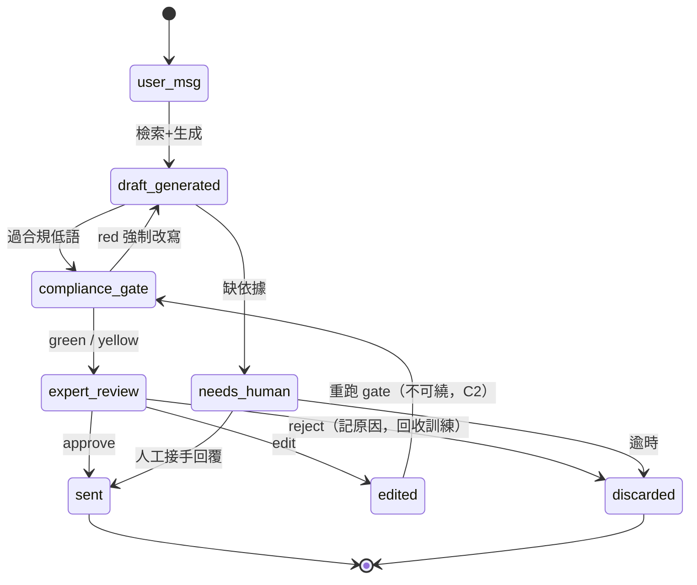

# System Spec — care-copilot（最薄切片）

> **📋 Status**: draft
> **🗓 Last updated**: 2026-05-28
> **👤 Owner**: `devteam-analyst`
> **🔖 Version**: v1
> **🎯 Scope**: care-copilot 最薄切片 = 訊息草稿 + 合規低語 + 活檔案（+ 離線 eval）
> **🔗 Related**: `docs/prd/ai-cs-mvg.md` · `docs/foundation/pilot_run.md` §3.1/§3.6/§3.12 · ADR-0001~0004

---

## 1. Use Cases

| ID | Use Case | Actor | 摘要 | Acceptance |
|:---|:---|:---|:---|:---|
| UC-1 | 建立/補充活檔案 | expert | 貼上 markdown / 手填 7 欄位 → 建結構化 contact + 互動時間軸 | 大部分客戶有基本三項以上；不同租戶 0 串 |
| UC-2 | 生成草稿 | system | 收到客戶訊息 → 檢索活檔案+知識 → opus 產 3 語氣草稿 | 草稿 grounded、過合規、p95<5s |
| UC-3 | 審核草稿 | expert | approve / edit / reject；approve → 回發（W2） | 三決定皆可；approve 後客戶收到 |
| UC-4 | 合規攔截 | system | 草稿過合規低語：綠過 / 黃提醒 / 紅強制改寫 | 高風險詞抓到；誤擋率低；100% 紀錄 |
| UC-5 | 離線 B1 驗證 | operator | 對測試集跑 draft→judge → 採用率裁決 | 達 GO/PIVOT/KILL 門檻（foundation/03） |

## 2. Business Rules

| ID | Rule | 來源 |
|:---|:---|:---|
| BR-1 | 草稿只能 grounded 在活檔案 + 知識；缺依據必標 `[需人工]`，禁幻覺 | PRD FR-002 / ADR-0003 |
| BR-2 | 合規紅燈 = gate，必須改寫才能送（送出鈕禁用） | PRD §3.12 / 原則3 |
| BR-3 | 跨 tenant 存取一律 deny（RLS + app 層） | legacy ADR-0007 |
| BR-4 | AI 永不自動發訊（draft mode），人類審每一則 | PRD §3.6 / legacy ADR-0002 |
| BR-5 | 每草稿/每訊息全稽核（used_chunks+model+decision+decided_by） | PRD §7 / 原則3 |
| BR-6 | 生產配置凍結；approve/edit/reject 回饋走離線改版 | ADR-0001 / 原則4 |
| BR-7 | 終端客戶個資：取得同意才處理；匯出 30 天 / 刪除 7 天 / 撤回即時 | `governance/consent-and-dpa.md` |
| BR-8 | 合規判定須溯源到法源（每詞有 authority + 法務 sign-off）；無法源的 red 詞不上線 | `governance/compliance-lexicon-authority.md` |

## 3. State Model

**Message lifecycle**：

**Compliance gate**：`green`（直接過）/ `yellow`（提醒可送）/ `red`（強制改寫，阻擋）。

## 4. Integration Inventory

| 外部 | 用途 | 介接 | 備註 |
|:---|:---|:---|:---|
| Anthropic API | opus 草稿 / haiku judge | nanobot LLM Adapter | prompt caching；多模型 fallback |
| Postgres + pgvector | 活檔案 / 知識 / 稽核 | RLS | 租戶隔離 |
| LINE | 回發 | **手動貼（pilot 不接 API）** | W2 |
| nanobot | runtime / MCP | 受 AEOS 凍結包覆 | ADR-0001 |

## 5. Edge Cases

- 知識檢索缺漏 → `[需人工]`，不硬答
- 客戶問動態資料（訂單）→ 標需人工（切片不接，OQ-004）
- 惡意/注入訊息 → 不被綁架、不外洩（紅隊邊界，W2+ 深化）
- 合規誤擋正常表達 → 可關單次 + 記原因

## 6. AEOS 核心 vs Care Copilot pack（兩軌標註）

- 🟦 **核心（垂直無關）**：UC-2 的 grounding/草稿機制、UC-4 的 Policy 引擎、UC-5 eval、BR-3/4/5/6、活檔案結構化模型（ADR-0003 標為垂直無關）
- 🟨 **pack（垂直特定）**：直銷語氣/persona、FTC/FDA 詞庫、活檔案的「健康關注/家庭」欄位語意、3 語氣 prompt

---

## 7. Review 修正 R2（2026-05-28 multi-role review）

### C3 — 切片 scope：UC-3 標 W2
- **W1** = UC-1(ingest) + UC-2(draft) + UC-5(eval，離線 judge 代人審，**無審核 UI**)。
- **UC-3**（審核台 approve/edit/reject）、UC-4 互動 gate = **W2**（precondition：有 expert web UI）。

### C2 / B-9 — state model 補完
- `edit` 後**必重跑 compliance gate**（不可繞紅燈）。
- `needs_human` 出口：轉人工 → 人工回覆 → `sent(human)`，或逾時 `discarded`，皆記 audit。
- **C2 manual_override**：red gate 時 expert 可選「改寫不適用 → 人工另寫」→ `decision=manual_override + reason`；AI 草稿不送、紅旗留 audit、**不繞送出人關**。

### C4 — ownership
- 合規判定（green/yellow/red）= **Policy Engine 權威**；`needs_human`（知識缺依據）= **知識/grounding 層權威**；API/runtime 僅傳輸不裁決。

### B-1 — acceptance 量化（取代模糊詞）
| UC | 可測 acceptance |
|---|---|
| UC-1 | 抽取欄位正確率 ≥ 80%（對標註集）；不同租戶 0 串（紅隊） |
| UC-2 | 對測試集 pass ≥ 70%（W1）；grounded = 有 citation 且 judge 不判幻覺 |
| UC-4 | 高風險詞召回 100%；誤擋率 ≤ 5% |
- UC↔FR 對映（5 UC ↔ 7 FR，**非 1:1**）：UC-1→FR-001、UC-2→FR-002、UC-3→FR-004、UC-4→FR-002 合規 gate(BR-2)、UC-5→FR-007;**FR-003**(訊息入口,W1 手動貼)/**FR-005**(稽核,橫切所有 UC)/**FR-006**(killswitch,ops)無專屬 UC。
