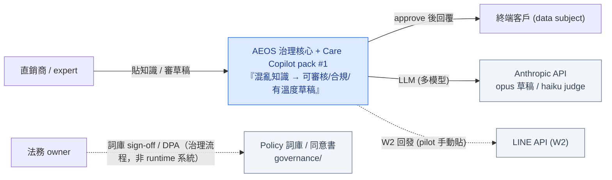
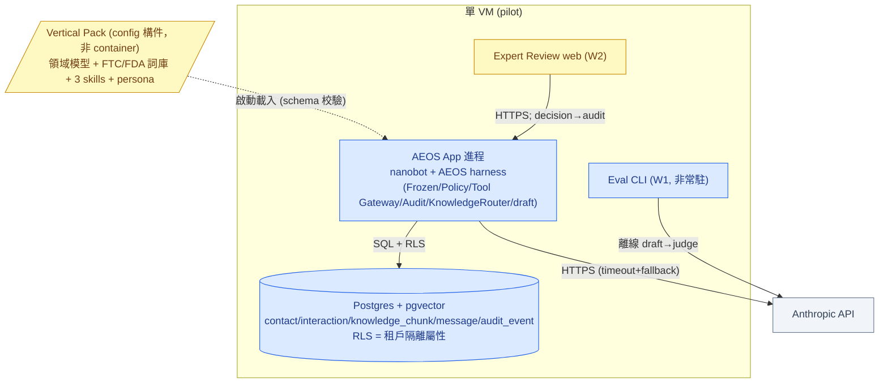
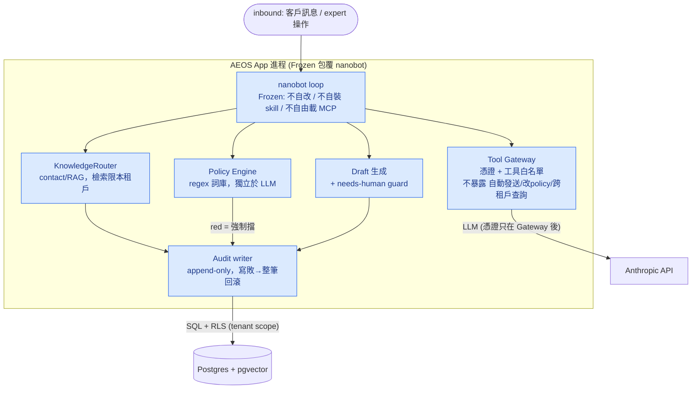

# C4 — care-copilot（L1 + L2 + L3 / 最薄切片）

> **Status**: draft · **Owner**: `devteam-arch` · **Date**: 2026-05-28 · **Feature**: care-copilot
> 範圍：AEOS 核心（垂直無關）+ Care Copilot pack #1（垂直特定）。最薄切片（草稿/合規/活檔案）。
> 對映 ADR-0001（nanobot runtime）/ ADR-0002（vertical pack 邊界）/ ADR-0003（結構化 contact）。

---

## L1 — System Context

**Our System 一句話責任**：把直銷商的混亂客戶知識，量產成可審核、合規、有溫度的草稿回覆（員工端工具）。

**邊界澄清**：
- **runtime 外部系統**只有 **Anthropic API**（pilot）；**LINE API 為 W2**（pilot 手動貼，不整合）。
- **法務/DPA 是治理 actor/流程**，非系統整合（修正：原圖誤列為下游系統）。
- **不**做客戶端 App（健康問卷不在最薄切片）；**不**接訂單系統（動態查詢 out, OQ-004）。

---

## L2 — Container（真實可部署單元）

> **修正**：container = 可獨立部署/執行的單元。對應 runbook §1 + threat-model 信任邊界圖的部署拓樸 = **1 VM、1 app 進程、1 DB**。原版把進程內元件與 DB 屬性誤列為 container，已收斂如下；元件細節下放 L3。

**雙軌**：🟦 AEOS 核心（垂直無關）/ 🟨 Care Copilot pack（垂直特定）。

| Container | 型態 | 軌 | Tech | 責任 |
|:---|:---|:--|:---|:---|
| **AEOS App 進程**（治理包覆的 nanobot runtime） | 進程 | 🟦 | Python(nanobot + AEOS harness) | 單一可部署進程：agent loop + 治理(Frozen/Policy/Tool Gateway/Audit) + KnowledgeRouter + draft。元件見 L3 |
| **Postgres + pgvector** | datastore | 🟦 | Postgres 16 + pgvector | contact/interaction/knowledge_chunk/message/audit_event;**RLS = 多租戶隔離屬性**(非獨立 container) |
| **Expert Review web**（W2） | 進程 | 🟨 | 最簡 web | approve/edit/reject;approve→回發(FR-004) |
| **Eval**（W1） | CLI 執行 | 🟦 | Python CLI(`aeos-mvg/`) | 離線打 B1(draft→judge→採用率);非常駐服務 |

> **Vertical Pack（Care Copilot）= 宣告式 config 構件，非 container**：領域模型 + FTC/FDA 詞庫 + 3 skills + persona，由 App 進程**載入**（ADR-0002：pack 是資料+規則，不另開執行路徑）。

### Inter-container / 外部（protocol / sync / failure）

| Edge | Protocol | Sync | Failure 策略 |
|:---|:---|:---|:---|
| App 進程 → Anthropic API | HTTPS | sync | timeout + fallback_models 重試（KB-10 §1）→ 仍失敗標 needs-human |
| App 進程 → Postgres | SQL + RLS | sync | 檢索缺漏 → 草稿標 `[需人工]`;audit 寫入失敗 → 整筆回滾 |
| App 進程 → Vertical Pack | 啟動載入 | — | pack schema 校驗失敗 → 拒載（threat-model §pack 投毒） |
| Expert Review → App 進程（W2） | HTTPS | sync | decision 落 audit;跨 tenant 預設 deny |
| 全體 → Tenant scope | RLS(DB 屬性) | — | 跨 tenant = 預設 deny;紅隊 TC-SEC-01 必過 |

**Deployment topology**：單 VM 內 App 進程 + Postgres;secrets 走 env（不進 git）;對外只 egress Anthropic（W2 加 LINE ingress）。對齊 `runbook-care-copilot.md` §1。

---

## L3 — Component（AEOS App 進程內部，驗 anti-bypass）

> 補上一輪 arch critique「C4 缺 L3 → anti-bypass 驗不了」。所有外部憑證在 **Tool Gateway 之後**;nanobot 本體不持有;紅燈與跨租戶在**進程內**就被擋。

| Component | 責任 | 對映 ADR / 鐵律 |
|:---|:---|:---|
| **Frozen 包覆** | 關閉 nanobot 自改 prompt / 自裝 skill / 自由載 MCP | ADR-0001 / threat-model **T-E-03** |
| **Tool Gateway** | 憑證持有 + 工具白名單;**不暴露**自動發送/改 policy/跨租戶查詢工具 | threat-model **LLM07/08**(excessive agency) / 未審自動發=0 |
| **Policy Engine（合規低語）** | regex 詞庫掃 green/yellow/red,**獨立於 LLM**;red 強制擋 | ADR-0002 pack 詞庫 / 外送踩線=0 |
| **KnowledgeRouter** | 三路:contact(結構化)/RAG(pgvector)/policy;檢索限**本租戶** | ADR-0003 / §6.3 |
| **Draft 生成** | grounded + needs-human guard;缺依據標 `[需人工]` | BR-1 |
| **LLM Adapter** | openai+anthropic+fallback;prompt caching;模型分層 | §13 |
| **Audit writer** | append-only(used_chunks/model/decision/decided_by/sent_at) | BR-5 / threat-model T-T-02 |

> **KnowledgeRouter = retrieval 側**（runtime 查詢）;**ingest 側**（知識進場治理）走 `knowledge-pipeline.md` 的 8 階段管線（ADR-0004,W1 只用 3 格:貼上→全當 Static→eval）。兩者經同一 Knowledge Store,但 ingest pipeline 是離線/批次,不在 runtime 熱路徑。

---

## Failure Modes（前 6）

| # | Failure | 偵測 | 復原 |
|:--|:---|:---|:---|
| 1 | LLM API 失敗/逾時 | 草稿生成 error / 延遲 | fallback_models 重試 → 仍失敗標 needs-human |
| 2 | 合規 sidecar 誤判（false positive） | 直銷商關閉率 / 申訴 | 可關單次 + 記原因回收調規則；false negative 由紅隊+人審第二道擋 |
| 3 | **跨租戶資料外洩（RLS 失效）** | 紅隊測試 / audit | RLS + app 層雙重防護；違規=P0 即停（blast radius 致命） |
| 4 | nanobot 自我擴展未凍結 → 行為漂移 | 配置快照 diff / drift 偵測 | Frozen 包覆強制關閉自改（ADR-0001） |
| 5 | 知識檢索缺漏 → 幻覺 | citation 缺 / judge reject | grounding + needs-human guard + 強制 citation |
| 6 | AI 成本爆量 | 成本/直銷商/日 監控 | Quota + circuit breaker 降階模型 |

---

## Observability 前置需求（交 devteam-ops 在 P5 實作）

- **Metrics（SLI）**：草稿延遲 p95 / 成功率、採用率(approve·edit·reject)、合規觸發率·誤判率、成本/直銷商/日、**跨租戶違規數(=0)**、外送踩線數(=0)
- **Logs**：structured，`conversation_id` 串接；每草稿記 `used_chunks + model + decision + decided_by`
- **Traces**：`draft → policy → audit` spans across containers
- **Alerts**：跨租戶違規 > 0（P0）、外送踩線 > 0（P0）、成本超 quota、採用率崩、killswitch 觸發

---

> Gate 4 evidence：NFR matrix（`nfr-care-copilot.md`）✓ · C4 L1+L2+L3 ✓ · ADR ≥1（ADR-0001/0002/0003/0004）✓ · Failure modes ≥5 ✓ · Observability 列出 ✓。
> 部署拓樸與 `runbook-care-copilot.md` §1、`security/threat-model.md` 信任邊界圖一致（1 VM / 1 app 進程 / 1 DB）。
