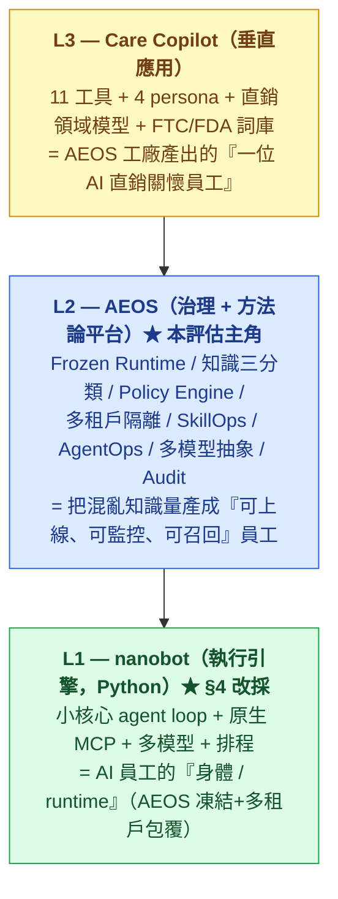

# 可行性評估 — AEOS 平台 × Care Copilot 垂直 × nanobot 執行引擎

> **📋 Status**: draft（feasibility spike，非實作承諾）
> **🗓 Last updated**: 2026-05-28
> **👤 Owner**: `devteam-arch`
> **🔖 Version**: v1
> **🎯 Scope**: AEOS × Care Copilot × nanobot 可行性評估（歷史 spike，導出 ADR-0001~0004）
> **🔗 Related**: `docs/foundation/pilot_run.md`（Care Copilot PRD v0.3）· `c4-care-copilot.md` · ADR-0001~0004 · `_legacy-dev_docs/02-product-architecture.md`

> [!NOTE]
> **詞彙對映（本文為歷史 spike，沿用 legacy 詞彙；當前架構以 C4 + ADR-0001~0004 為準）**：
> - **執行引擎**：本文評估 pi 後**收斂為 nanobot**（§4 / ADR-0001）；標題與 §1 已更新，內文 pi 段保留為決策軌跡。
> - **MC-0xx 模組契約**定義在 `_legacy-dev_docs`（已退役）。對映當前 C4 元件：MC-001 Policy+Audit→**Policy Engine + Audit writer**;MC-003 evaluation→**Eval**;MC-004 tenant-manager→**Postgres RLS（屬性，非獨立 container）**;MC-005 skill→**Vertical Pack skills**;MC-006 tool-registry→**Tool Gateway**;MC-008 knowledge-rag→**KnowledgeRouter**;MC-010 conversation-engine→**Draft 生成**。詳見 `c4-care-copilot.md` L2/L3。
> - **11 工具** = Care Copilot 垂直全集（`pilot_run.md`），**非本次 freeze scope**（最薄切片只取 3 工具，見 PRD 命名註記）。

> **問題**：現有 AEOS 架構能滿足 Care Copilot（直銷關懷 Copilot, pilot_run.md）的客戶需求到什麼程度？底層用 pi agent 跑是否可行？這個垂直能否驗證「AEOS = 跨所有垂直領域的平台」這個本質目標？
>
> **一句話結論**：**可行，且強烈正向。** Care Copilot 的客戶 PRD **獨立地重新推導出 AEOS ~70% 的治理原語**（多租戶隔離 / 合規 sidecar / 學習紀錄 / 多模型抽象 / 草稿不自動送 / 知識結構化）——這是 AEOS 抓對「垂直無關的真需求」的最強證據。執行引擎已收斂為 **nanobot（Python）+ AEOS 治理包覆**；剩餘缺口集中在**垂直領域模型 + 結構化 contact 知識模型**，不在治理核心。

---

## 1. 三層堆疊模型（誰負責什麼）

對映北極星（`07-north-star.md`）：**Care Copilot = 工廠產出的第一台員工；11 工具 = 它的 skills；直銷商 = tenants；pi = 可重組的身體；AEOS = 工廠本身。** 這正是「工廠即產品」要驗證的第一個垂直。

---

## 2. 核心發現：客戶 PRD 獨立收斂到 AEOS 治理模型

Care Copilot 的 §5 架構與 §6 NFR **不是照 AEOS 設計的**，卻獨立得出下列與 AEOS 幾乎一對一的決策：

| Care Copilot 自己寫的（pilot_run.md） | 對映的 AEOS 原語 | 收斂度 |
|---|---|---|
| Supabase RLS 租戶隔離、「不同直銷商資料 0 串」、紅隊必過（情境 14） | 多租戶隔離（legacy ADR-0007 RLS + app 層） | **完全一致** |
| 合規低語 regex sidecar <50ms、所有外送都過、100% 紀錄 | Policy Engine + Audit（原則 3 / MC-001） | **完全一致** |
| 草稿模式「AI 絕不自動送出」 | Frozen Runtime + 草稿閘門（原則 4 / legacy ADR-0002） | **完全一致** |
| 學習紀錄 Day 1（情緒判斷/警示採納/草稿採用） | AgentOps Evaluation + SkillOps 回流（原則 5 / §12） | **完全一致** |
| LangGraph 外包一層抽象「避免被 vendor 綁死」 | 多模型抽象層 LLMProviderAdapter（§13） | **完全一致** |
| 活檔案（結構化）+ pgvector + 不爬 LINE 歷史 | 知識三分類（§6.3 Static/Policy/Dynamic）+ 隱私底線 | **方向一致** |
| 成本 ≤$0.30/直銷商/日 | Tenant/Employee Quota + Cost Circuit Breaker（§13.3） | **完全一致** |
| 多品牌 Day 1 抽象、不建品牌後台 | 多租戶 + Tenant Manager（MC-004），切口窄架構寬（§22.2） | **完全一致** |

> **這是可行性的決定性證據**：一個沒看過 AEOS 的客戶團隊，為了把直銷關懷做對，**被迫重新發明了 AEOS 的治理骨架**。代表 AEOS 鎖定的是「任何要把 AI 放進真實業務」的垂直無關剛需，不是客服特例。**這正是「AEOS 可跨所有垂直」本質目標要的證據。**

---

## 3. Fit-Gap 矩陣：11 工具 + 平台支撐 vs AEOS 模組

圖例：🟢 AEOS 現成覆蓋 / 🟡 AEOS 部分覆蓋（需配置或薄擴充）/ 🔵 垂直客製（AEOS 提供容器，內容客製）/ 🔴 AEOS 需新增能力

| Care Copilot 元件 | 對映 AEOS 模組 | 覆蓋 | 說明 |
|---|---|:--:|---|
| 訊息草稿（3 語氣） | conversation-engine(MC-010) + skill(MC-005) | 🟢 | **就是 ai-cs-mvg 的核心**：知識 grounded 草稿 + 多語氣。AEOS 主鏈路本體 |
| 合規低語 | Policy Engine + audit(MC-001) | 🟢 | AEOS 治理核心。50 詞 regex = Policy Rule 的最小版 |
| 關係記憶活檔案 | knowledge-rag(MC-008) | 🟡 | AEOS 知識偏「文件/RAG」；活檔案是**結構化 CRM 記錄**（7 欄位 + 互動時間軸）→ 需擴 knowledge 模型納入 structured contact（屬 Dynamic Knowledge 變體） |
| 情緒感測器（三檔） | skill(MC-005, Haiku 分類) | 🟢 | 一個分類 skill。AEOS skill 容器直接裝 |
| 太業務員警報 | Policy Engine（規則） | 🟢 | 規則型 sidecar = Policy Rule。AEOS 現成 |
| 快速異議處理器 | skill(MC-005) | 🟢 | 一個生成 skill |
| 生活事件雷達 | skill + scheduler | 🟡 | 抽取是 skill；**定時偵測/排程**非 AEOS 核心 → 需薄排程層 |
| 樣品追蹤 | workflow + scheduler | 🟡 | 48/72h/7d 跟進 = Workflow + 排程。AEOS 有 Workflow 概念，排程要補 |
| 今日 5 件事 | workflow 聚合 + UI | 🟡 | 跨來源優先序聚合，偏應用層編排；AEOS 提供事件來源，聚合邏輯垂直客製 |
| 招募漏斗 | workflow + skill | 🔵 | 四階段轉換 = 直銷特有領域模型，AEOS 提供容器 |
| 語音草稿（TTS） | tool-registry(MC-006) | 🟢 | 受治理外部工具（OpenAI/ElevenLabs TTS）= Tool Gateway 標準件 |
| 健康問卷（客戶端） | workflow + 一次性連結 | 🔴 | **客戶端 no-login 介面** — AEOS 是員工端平台，無客戶端 surface → 需新增（或視為垂直 app 自建） |
| 多租戶隔離 | tenant-manager(MC-004) | 🟢 | AEOS 身份級核心 |
| 學習紀錄 | evaluation-service(MC-003) | 🟢 | AgentOps 本體 |
| 成本上限 $0.30/日 | Quota + Cost governance(§13) | 🟢 | AEOS 成本治理 |
| Freemium/付費分級/病毒 | （非 AEOS scope） | 🔴 | 商業層，AEOS 不管，垂直 app 自建 |
| Mobile PWA 前端 | （非 AEOS scope） | 🔴 | AEOS 是後端治理平台，前端垂直自建 |

**統計**：🟢 9 項（治理核心全中）/ 🟡 4 項（薄擴充）/ 🔵🔴 客製或非 scope。**AI/治理層覆蓋率 ~70%；缺口集中在「排程、結構化 CRM 模型、客戶端 surface、商業/前端層」——皆非 AEOS 護城河。**

---

## 4. 執行引擎評估：pi（TS）out → nanobot（Python）in

**先修正一個過窄的判斷**：MCP / plugin 整合外部系統這層**確實需要 agentic**（tool-calling 編排、多步取數、錯誤重試）—— agent loop 的需求在**整合層**，不在 11 個產品工具（情緒/草稿/合規那些是 single-shot）。所以底層需要一個真正的 agent runtime，不只是 LLM 抽象。

加上「**底層全 Python**」的硬要求：

| 候選 | 語言 | agentic + MCP | 裁決 |
|---|---|---|---|
| **pi**（earendil-works） | TypeScript | ✅ 強（coding agent harness） | 🔴 **出局** — 與 Python 底層分裂；且偏 coding agent（對映 `02 §4.3` 反模式） |
| **nanobot**（HKUDS/nanobot） | **Python ≥3.11** | ✅ 原生 MCP（多 server / SSE / 自訂 auth / resources+prompts as tools） | 🟢 **建議採用** |

**nanobot 為何是對的底層**（MIT, PyPI `nanobot-ai`）：

| 需求 | nanobot 現成 |
|---|---|
| Python 底層 | ✅ Python ≥3.11，與 AEOS / Care Copilot FastAPI 同語言 |
| agentic + MCP 整合外部系統 | ✅ 小而可讀 agent loop + 原生多 MCP server / SSE / 自訂 auth；`/goal` 長程多步編排 |
| 多模型抽象（= AEOS §13） | ✅ 原生 `openai` + `anthropic` SDK（已移除 litellm）+ `fallback_models` → **不需另接 pi-ai** |
| prompt caching / adaptive thinking（成本槓桿） | ✅ Anthropic prompt caching + adaptive thinking 內建 |
| 排程/提醒（樣品 48/72h、生日、沉睡 30 天） | ✅ 內建 cron/schedules/reminders → **直接補上 §5 gap #2** |
| skills / memory / sandbox / 可觀測 | ✅ skill 機制、Dream memory、shell sandbox、Langfuse/LangSmith |
| chat channels | ✅ Telegram/Slack/Discord/WhatsApp/Feishu/WeChat…（LINE 未內建，但 Care Copilot 是「草稿+手動貼 LINE」，pilot 不需 LINE API） |

> **強一致性訊號**：AEOS 自己的架構（`02 §4.1 / §4.4.2`）**早就把「nanobot 類」選為 Production Frozen Runtime 候選**，並寫明「保留小核心 agent loop + chat + MCP client；包覆/移除 自由載入 MCP server、自我修改、跨 tenant 存取」。HKUDS/nanobot 正是那個「nanobot 類」的具體實作 → 採用它**不是新決定，是兌現 AEOS 既有架構選型**。

**AEOS 對 nanobot 必加的治理包覆**（這是 AEOS 的價值，不是 nanobot 的責任）：
1. **Frozen Runtime**：生產關掉 nanobot 的自我擴展（自裝 skill / 自改 prompt / 自由載入任意 MCP）→ 凍結配置快照，回饋走離線（legacy ADR-0002 / 原則 4）
2. **多租戶隔離**：nanobot 是「個人長駐 agent」非多租戶 → AEOS 以 tenant-manager + RLS 包出 multi-tenant，每位直銷商一個受隔離 runtime context（legacy ADR-0007）
3. **Tool Gateway / Policy 前置**：MCP 工具呼叫前過 AEOS Policy Engine + Audit（原則 3），不讓 nanobot 直連外部系統憑證

---

## 5. 可行性裁決

| 維度 | 裁決 |
|---|---|
| **治理層可行性** | 🟢 高 — AEOS 治理原語幾乎全中，客戶 PRD 已獨立驗證需求真實 |
| **AI 工具可行性** | 🟢 高 — 9/11 工具 = skill/policy/tool 容器直接裝；2 個（活檔案結構化、客戶問卷）需薄擴充或垂直自建 |
| **執行引擎(pi)** | 🟡 條件可行 — 用 pi-ai 當 LLM 抽象 OK；pi-agent-core 對 pilot overkill 且有 TS/Python 分裂風險 |
| **橫向平台命題** | 🟢 **被強化** — 客戶獨立收斂到 AEOS 治理 = 平台抽象選對了 |
| **整體** | ✅ **可行，建議推進到一個「最薄垂直切片」spike 驗證**（不是全 11 工具，先打 1–2 個最能證明 AEOS×垂直的工具） |

**AEOS 為了服務這個垂直，必須補的能力（gap → backlog）**：
1. 🔴 knowledge 模型擴充：納入**結構化 contact 記錄**（活檔案 7 欄位 + 互動時間軸），不只 doc-RAG
2. 🟢 排程/提醒層（樣品 48/72h/7d、生日、沉睡 30 天）→ **nanobot 內建 cron/schedules，gap 大幅縮小**，AEOS 只需治理包覆
3. 🟡 垂直**領域包**機制：直銷關係模型 + FTC/FDA 詞庫 + 11 種異議庫 = 可插拔的「vertical pack」（這是 AEOS 橫向化的關鍵抽象）
4. 🟢 LLM 抽象層 → 用 **nanobot 原生 multi-provider**（openai+anthropic+fallback），不需自建、不需 pi-ai
5. 🟡 runtime 治理包覆：在 nanobot 外加 Frozen + 多租戶 + Tool Gateway/Policy（見 §4）
6. （客戶端問卷 surface、Mobile PWA、Freemium/商業層 → 垂直 app 自建，不進 AEOS 平台）

---

## 6. 橫向平台檢驗（本質目標）

| 問題 | 答案 |
|---|---|
| 哪些是**垂直無關、可重用**的？ | Frozen Runtime / Policy+合規 / 多租戶隔離 / Audit / 草稿閘門 / 知識治理 / AgentOps / 多模型 / Quota — **AEOS 護城河全部可重用** |
| 哪些是**垂直特定**的？ | 11 個具體工具、直銷關係模型、FTC/FDA 詞庫、persona、異議庫、Mobile UI、商業分級 |
| 怎麼讓 AEOS 真正「跨所有垂直」？ | 把垂直特定的東西收斂成**可插拔 vertical pack**（領域模型 + 詞庫 + skill 集 + persona），AEOS 核心保持垂直無關。Care Copilot = 第一個 vertical pack，驗證這個抽象 |
| 這個垂直**證偽**了平台命題嗎？ | ❌ 沒有 — 反而**強化**：客戶獨立收斂到 AEOS 治理，且缺口都落在「可插拔垂直包」而非核心 |

> **戰略洞察**：Care Copilot 不只是一個客戶，是 AEOS「vertical pack」抽象的**第一個試金石**。若 1–2 個工具的 spike 能證明「AEOS 核心不動 + 換 vertical pack = 服務新垂直」，則「工廠跨垂直」命題成立，這比做完 11 個工具更重要。

---

## 7. 風險與紅旗

| 風險 | 等級 | 護欄 |
|---|---|---|
| 直接裸用 nanobot（不加治理包覆）跑生產 | 🔴 | nanobot 預設可自我擴展 + 個人單租戶 → 生產必須先包 Frozen + 多租戶 + Policy/Audit（§4），否則違反 AEOS 原則 4/原則 3/legacy ADR-0007 |
| 為了接客戶，AEOS 核心被直銷需求污染（失去垂直無關性） | 🔴 | 垂直特定一律進 vertical pack，核心保持中立 — 違反即偏離橫向平台命題 |
| pilot 想一次做完 11 工具 | 🟡 | 先做最薄切片 spike（訊息草稿+合規低語+活檔案），證明 AEOS×垂直可行再擴 |
| 被 nanobot 上游版本變動牽動（活躍開發中） | 🟡 | 釘版本 + 把 AEOS 治理層與 nanobot 核心解耦（包覆而非 fork）；nanobot MIT 可控 |
| 客戶 PRD 已是 v0.3 完整規格，誘使跳過 AEOS 抽象直接照刻 | 🟡 | 照刻 = 又一個垂直孤島，違反平台目標；務必走 vertical-pack 抽象 |

---

## 8. 建議下一步（router 交棒）

1. **最薄垂直切片 spike**（建議先做）：用 AEOS 核心 + pi-ai，實作 **訊息草稿 + 合規低語 + 活檔案**3 件，對 1 位 Synergy 教練的真實名單跑——同時驗證「B1 草稿可用」與「AEOS 核心 + vertical pack 可行」。可直接複用既有 `aeos-mvg/` W1 骨架。
2. **ADR 候選**（若推進，走 `/devteam-arch`）：
   - ADR：**採 nanobot 為 Frozen Runtime 底層** + 治理包覆邊界（凍結自我擴展 / 多租戶隔離 / Tool Gateway+Policy 前置）— 補充/落地 legacy ADR-0002
   - ADR：vertical pack 抽象（領域模型 + 詞庫 + skill 集的可插拔邊界）= 橫向化關鍵
   - ADR：結構化 contact 納入 knowledge 模型的方式（活檔案 vs 知識三分類）
3. **不做**：不照 pilot_run.md 全刻 11 工具；不採 pi（TS，與 Python 底層分裂）；**不裸用 nanobot**（生產必先加治理包覆）。

---

> **路由狀態**：feasibility spike v2 完成 → 可行，runtime 選型收斂為 **nanobot（Python）+ AEOS 治理包覆**。下一步建議 `/devteam-arch` 把 §8 三個 ADR 候選正式化，或直接做最薄切片 spike。現有 `ai-cs-mvg` 的 W1 骨架（Python + Anthropic SDK + prompt caching）可複用為此 spike 的起點。
