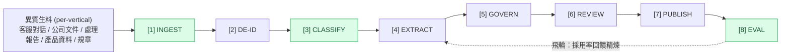

# 知識攝取與治理管線 — Spec（core 骨架 + vertical pack）

> **📋 Status**: draft
> **🗓 Last updated**: 2026-05-28
> **👤 Owner**: `devteam-arch` / `devteam-design`
> **🔖 Version**: v1
> **🎯 Scope**: care-copilot（pack #1）知識 ingestion 治理管線（8 階段，W1 用 3 格）
> **🔗 Related**: ADR-0004（管線決策）· ADR-0002（pack 邊界）· ADR-0003（結構化 contact）· legacy ADR-0005（PII）· `02 §6.3`（三分類）
>
> **定位**：B1 的原料端 = 北極星工廠的「原料倉 → 鑄造」段。**階段(機制)通用、不變;每產業差異是各階段的 config。**

---

## 0. 管線總覽



**最小 B1 路徑（先只走這 3 格）**：`[1]貼上 → [3]全當 Static → draft → [8]eval 採用率` = 現有 `aeos-mvg/` W1。其餘階段被真實需求觸發才加（見 §3 成長觸發）。

---

## 1. 核心資料契約（介面,先定型再實作）

```yaml
# RawItem — [1] 正規化後的生料單元
RawItem:
  id: str
  tenant_id: str
  source_type: enum[chat_log, document, case_report, product_info, policy_doc, paste]
  raw_text: str            # 已正規化純文字
  meta: { origin, captured_at, author?, lang }

# KnowledgeUnit — [4] 萃取後、[5]~[7] 治理發布的原子知識
KnowledgeUnit:
  id: str
  tenant_id: str
  kind: enum[static_chunk, qa_pair, policy_rule, case_template, structured_field]
  content: str | dict      # qa_pair={q,a}; policy_rule={pattern,severity}; structured_field={field,value}
  citation: { source_id, source_version, confidence }   # 強制,無源不可發布
  risk_level: enum[low, medium, high]
  valid_until: date?       # 失效期
  status: enum[candidate, approved, published, deprecated]
  version: int

# VerticalPackConfig — 各階段插點(換產業換這份,不動 core)
VerticalPackConfig:
  vertical: str            # e.g. mlm-wellness
  ingest_adapters: [...]
  pii_fields: [...]        # 敏感欄位 + 適用法規
  classify_rules: {...}    # 此產業什麼算 Static / Policy
  extract_prompts: {...}   # Q-A 樣式 / 異議類型
  compliance_lexicon: [...]# 紅線詞庫(FTC/FDA/醫療...)
  review_policy: {...}     # 誰覆核 / 驗收標準
  knowledge_schema: {...}  # 如活檔案 7 欄位
  b1_rubric: {...}         # 測試集 + 採用門檻
```

---

## 2. 八階段規格（input → process → output ｜ 🟦core / 🟨pack）

| # | 階段 | Input → Output | 🟦 Core 機制 | 🟨 Pack config | 鐵律 |
|:--|:--|:--|:--|:--|:--|
| 1 | **INGEST** 接收正規化 | 生料 → `RawItem` | adapter 框架 + 正規化 | 哪些來源、格式解析器 | — |
| 2 | **DE-IDENTIFY** 脫敏 | `RawItem` → 遮罩後 `RawItem` | PII 偵測引擎 + 遮罩 | 敏感欄位、法規(個資法/HIPAA) | **未脫敏不下游**(legacy ADR-0005) |
| 3 | **CLASSIFY** 三分類路由 | `RawItem` → 標 kind | §6.3 router | 此產業 Static/Policy 判準 | Dynamic 不存,標 live-query |
| 4 | **EXTRACT** 萃取 | `RawItem` → `KnowledgeUnit[candidate]` | LLM 萃取編排 + Q-A/case 抽取器 | 萃取 prompt、Q-A 樣式、異議類型 | 對話→Q-A/失敗案例/異議;報告→解法樣板;文件→chunk+事實 |
| 5 | **GOVERN** 治理 | candidate → 標 citation/risk/valid_until | 源綁定 + 衝突調解 + 合規掃描 + 版控 | **合規紅線詞庫** + 信賴規則 | 無 citation 不可進下一步;衝突顯化不腦補 |
| 6 | **REVIEW** 人類覆核 | candidate → `approved` | 專家覆核 workflow(training room §10) | 誰覆核、領域驗收標準 | 精煉收口在人,不全自動 |
| 7 | **PUBLISH** 發布 | approved → `published`(版本化) | 版本化 store(RAG/Rule/structured)+ frozen snapshot | knowledge schema(活檔案欄位) | 像 skill 一樣版控、可 rollback(§9) |
| 8 | **EVAL & REFINE** 回饋 | 採用率/遙測 → 精煉訊號 | 採用率遙測 + 飛輪 | B1 rubric、採用門檻 | 回 [4]/[5] 精煉(§12) |

### [3] CLASSIFY 三路（§6.3,治理分歧點）
| kind | 路由 | store | 例 |
|:--|:--|:--|:--|
| Static | 索引/chunk | pgvector RAG | FAQ、產品、SOP |
| Policy | 規則/詞庫 | Rule engine | 退款規則、合規紅線 |
| Dynamic | **不存**,live-query | Tool/API | 訂單、庫存 |
| Structured | 結構化 | contact/case store(ADR-0003) | 活檔案、案件 |

---

## 3. 成長觸發（每階段被真實需求叫出來才建,非預先）

| 觸發事件 | 啟用階段 |
|:---|:---|
| **打 B1（現在）** | [1]貼上 + [3]全 Static + draft + [8]eval（= aeos-mvg W1） |
| 開始吃**客服對話原始 log**（噪音+PII+量） | [2]De-id + [4]Extract（Q-A/案例萃取） |
| 知識量大、有矛盾、要合規 | [5]Govern（源綁定/衝突/紅線掃描） |
| 多人維護、要驗收品質 | [6]Review（專家覆核 / training room） |
| 知識要版控、改版、rollback | [7]Publish（版本化） |
| pilot 上線、有採用率資料 | [8]Refine（飛輪精煉） |

> Elon 式:**8 階段是長大後的樣子,B1 只需 3 格。** 介面契約(§1)現在定型,實作從最薄路徑長。

---

## 4. 治理鐵律（防 AI slop 的根源治理）

1. **分類在前,別全塞 RAG**（§6.3 反模式）
2. **源綁定強制** — 無 `citation` 的 KnowledgeUnit 不可發布(幻覺根源)
3. **脫敏在最前** — [2] 在 [4] 之前,未遮罩不萃取
4. **人類在 [6] 收口** — 精煉是專家判斷
5. **版本化+凍結** — 發布即快照,可 rollback(SkillOps)
6. **衝突顯化,不腦補** — 矛盾資訊標記給人,禁自動合成「看似合理版本」
7. **飛輪閉環** — [8] 採用率回饋哪些知識好用 → 精煉

---

## 5. 與既有架構對映

| 管線概念 | 既有 AEOS |
|:---|:---|
| [3] 三分類 | `02 §6.3` Static/Policy/Dynamic |
| [2] 脫敏 | legacy ADR-0005 PII;`02 §10.5` 訓練資料治理 |
| [4]-[6] 萃取→治理→覆核 | `02 §9` SkillOps Pipeline + §10 Training Room |
| [5] citation | `02 §6.2` KnowledgeCitation（無源視為幻覺） |
| [7] 版本化 | §9 Skill 版本管理 |
| [8] 飛輪 | §12 AgentOps + §29 三 Compiler |
| Structured 路由 | ADR-0003 結構化 contact |
| core/pack 切法 | ADR-0002 |
