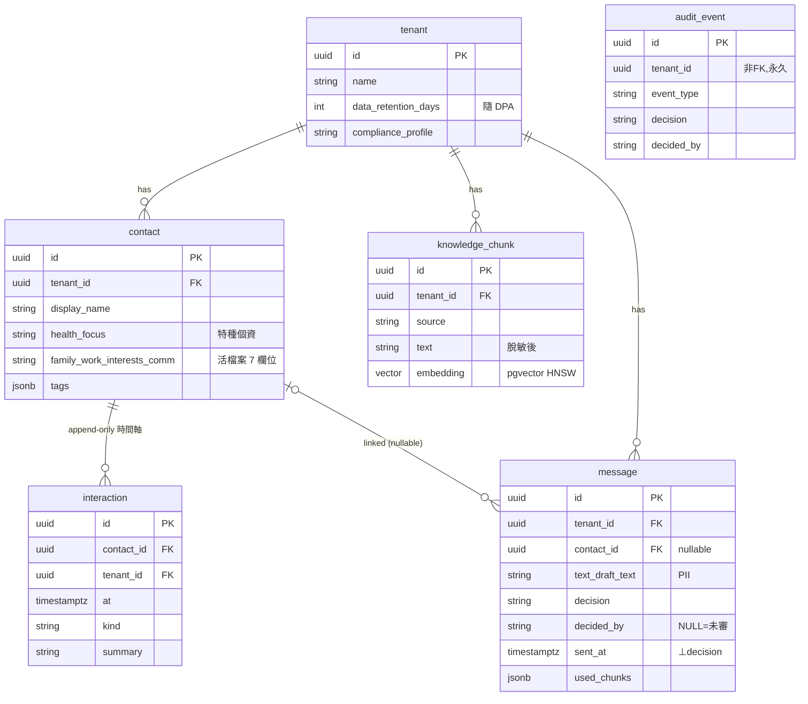

# ERD + 模組/Error Model — care-copilot（最薄切片）

> **📋 Status**: draft
> **🗓 Last updated**: 2026-05-28
> **👤 Owner**: `devteam-design`
> **🔖 Version**: v1
> **🎯 Scope**: care-copilot 切片資料模型（6 表）+ Error Model。所有**業務表**帶 `tenant_id` + RLS；`tenant` root 表無 tenant_id，由 GRANT 控管讀取範圍
> **🔗 Related**: ADR-0003（結構化 contact）· system-spec §3-4 · NFR Privacy · `data/migrations/`

---

## ERD（切片 6 表）

> `message` 一張表幹三件事（對話紀錄 + audit log + 訓練素材），消滅資料複製（foundation/02 §3.2）。
> `contact`(結構化) 與 `knowledge_chunk`(語意檢索) 分開 = ADR-0003 的 KnowledgeRouter 兩路。
> `audit_event`（R2）去識別化、append-only、永久，不存原文、`tenant_id` 非 FK（tenant 刪除後仍留）。

## 路由（KnowledgeRouter，§6.3 三分類）

| 查詢 | 路由 | 對象 |
|:---|:---|:---|
| 客戶結構化屬性（年資/標籤/健康關注） | **structured query** | `contact` + `interaction` |
| 產品/FAQ 自由文本 | **RAG** | `knowledge_chunk`(pgvector) |
| 合規規則 | **Policy** | vertical pack 詞庫（非 DB） |

> **KnowledgeUnit → 儲存映射**（對齊 `architecture/knowledge-pipeline.md` 介面契約）:`kind=static_chunk` → `knowledge_chunk`(pgvector);`kind=structured_field` → `contact` 欄位;`kind=policy_rule` → pack 詞庫(非 DB)。三 kind 各有落點,無遺漏。

## 模組責任（切片，可平行實作）

| 模組 | 責任 | 軌 |
|:---|:---|:--|
| `runtime`（nanobot 包覆） | agent loop + 編排 | 🟦 core |
| `policy`（合規低語） | regex 詞庫掃描 → green/yellow/red gate | 🟦 core 引擎 + 🟨 pack 詞庫 |
| `knowledge` | KnowledgeRouter（contact/RAG）+ ingest | 🟦 core |
| `draft` | 檢索 + LLM 生成 + needs-human guard | 🟦 core 機制 + 🟨 pack prompt |
| `audit` | append-only 寫入；失敗即回滾 | 🟦 core |
| `eval` | 離線 draft→judge | 🟦 core |

## Error Model

| 類別 | HTTP | 行為 |
|:---|:---|:---|
| 跨租戶存取 | 403 | deny by default；記 audit；紅隊必過 |
| 知識缺依據 | 422 | `needs_human=true`，不回幻覺草稿 |
| 合規紅燈 | 200 + `compliance=red` | 送出鈕禁用，必須改寫（business gate，非 error） |
| LLM 失敗 | 503 / 重試 | fallback_models；仍失敗標 needs_human |
| Audit 寫入失敗 | 500 | 整筆操作回滾（不允許靜默成功） |

## Privacy（NFR 對應）
- `contact`/`interaction` 含 PII；`data_retention_days` 隨 tenant DPA；匯出 30 天 / 刪除 7 天。
- 不爬 LINE 歷史；資料全由直銷商主動補。

---

## Review 修正 R2（2026-05-28 multi-role review）

### C1 / B-3 — audit 與 PII retention 拆解（dba×sre 衝突裁決）
- 新增 **`audit_event`**（append-only、**永久**、去識別化）：`(id, tenant_id, event_type, message_id, used_chunks jsonb, model, decision, decided_by, at)` — **不存原文**。
- `message.text` / `draft_text` / contact PII 隨 `tenant.data_retention_days`（DPA，到期刪）。
- 結論：audit 100% 長存（去識別化）+ PII 可刪，**不再互斥**。

### B-3 — PII map（欄位 × 等級 × retention）
| 表.欄位 | 等級 | retention |
|---|---|---|
| **contact.health_focus** | **特種個資**（需明示同意，可單獨撤回） | 隨 DPA；撤回即停止推論 |
| contact.（其餘）/ interaction.summary | PII | 隨 DPA（匯出 30 天 / 刪除 7 天） |
| message（整 row：text·draft_text·decided_by 等） | PII（row-level retention） | 隨 DPA（整 row 刪） |
| knowledge_chunk.text | 脫敏後 | 隨 DPA |
| audit_event.*（去識別化） | 非 PII | 永久 |
- 特種個資（health_focus）合法性與撤回見 `governance/consent-and-dpa.md`。
- 刪除/匿名化 job：到期掃 contact/interaction/message（整 row）+ `knowledge_chunk` 殘留。

### B-4 — migration / index / RLS（✅ 已落地 `migrations/`）
實際 DDL 見 [`docs/data/migrations/0001_init_schema.up.sql`](./migrations/0001_init_schema.up.sql)（+ `.down.sql` + `README.md`）:
- **migration**：每表 up/down DDL；結構化 contact 上線走雙寫 ≥ 1 release（README §上線注意）。
- **index**：interaction/message 用 `(tenant_id, contact_id)` composite；所有 `tenant_id` 建 index；`knowledge_chunk.embedding` 用 pgvector **HNSW**（`vector(1024)` ASSUMPTION，W2 對齊 embedding 模型）。
- **RLS**：每表 `ENABLE + FORCE` + `tenant_isolation` policy 原文納 migration；`current_tenant()` 讀 GUC，缺值 deny。
- **PITR**：備份視窗涵蓋 ≥ 7 天刪除緩衝（接 `governance/consent-and-dpa.md`）。
