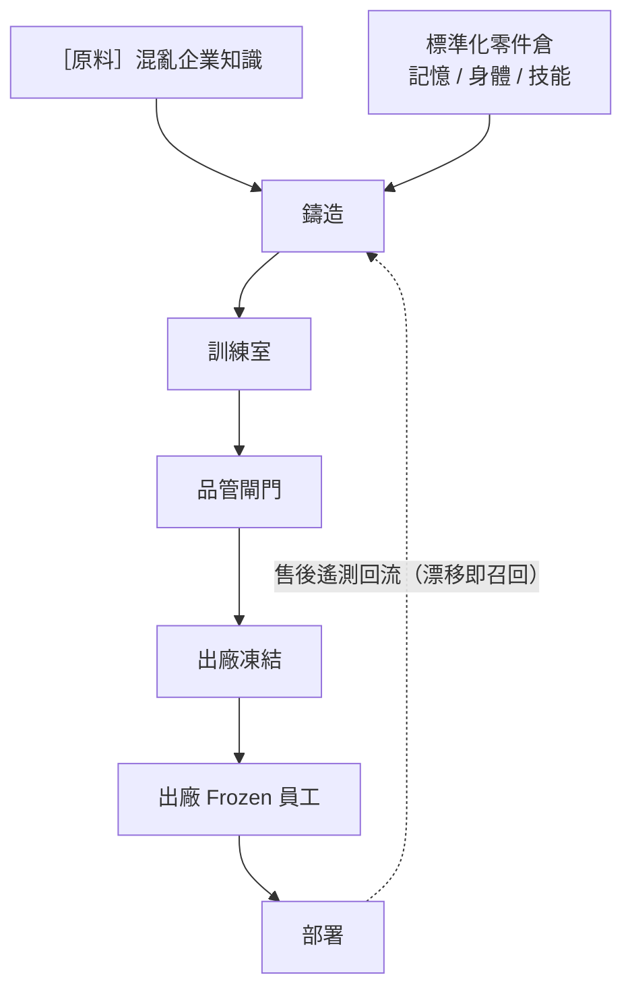

# North Star — 10 年工廠願景與工作法

> 賭注（[`00-the-bet.md`](./00-the-bet.md)）是現在要證明的；北極星是賭注成立後要長成的樣子。**先讀賭注，這份是方向不是待辦。**

---

## 1. 願景：工廠即產品

AEOS 真正的產品不是 AI 員工，是**量產 AI 員工的工廠**。



## 2. 五大未來科技支柱

| # | 支柱 | 一句話 |
|---|------|--------|
| 1 | **可抽換記憶** | 記憶是可拆卸、可版控、可移植的模組——能備份、回滾、移植到另一個身體 |
| 2 | **可重組身體** | 同一顆腦/記憶可換不同身體規格（通道×模型×工具），像換工裝 |
| 3 | **自主沙盒鑄造** | 訓練室自我博弈量產 Skill 候選，人只審核不陪練 |
| 4 | **全景遙測** | 出廠每一台終身被監控，漂移自動觸發召回再訓練 |
| 5 | **生態飛輪** | 遙測回流 + 零件市場 + 跨企業勞動網，越用越強 |

**三零件互換協議**（科幻願景的工程化落點）：記憶可移植、身體可重組、角色可重扮——皆在 tenant 隔離與審計約束內。

## 3. Elon 五步工作法（順序神聖，不可顛倒）

```
1 質疑需求 → 這是真需求，還是因為「別人都這樣」類比來的？
2 刪除     → 能刪就刪。最好的零件/流程是不存在的那個。
3 簡化     → 刪不掉的簡化到極限。
4 加速     → 簡化後才談加速。
5 自動化   → 最後才做。
```

**兩條血淚鐵律**：

- **驗證前不自動化**：先自動化 = 把還沒驗證對不對的流程用機器人放大。連一條人工產線都沒跑過時，別蓋自動化產線。
- **驗證前不文件化想像**：在驗證核心賭注前把想像中的流程文件化，等於用文件把未驗證假設「固化」成既定事實——之後每改一個假設，文件就 cascade。文件要記錄**被迫做的取捨**，不是預先規劃所有可能。

## 4. 垂直整合邊界

| 環節 | 自製/外包 | 理由 |
|---|---|---|
| 記憶層（規格 + 互換協議） | **自製** | 護城河核心 |
| Harness / Frozen Runtime | **自製** | 學習/生產分離是身份 |
| 訓練室鑄造引擎 / 全景遙測 | **自製** | 量產與監控 = 工廠本體 |
| LLM 模型 | **外包但抽象化** | 多模型層，絕不綁單一供應商 |
| 基礎設施 | **外包** | 非護城河，延後到規模需要 |

## 5. 紅線 / Non-goals

| 紅線 | 違反後果 |
|---|---|
| 不進 white-collar Copilot 戰場 | 大廠主場，送死 |
| 不賣裸 Agent + RAG + Workflow Designer | 會被 AI 動態生成取代；賣的是治理過、可監控可召回的零件與產線 |
| 不做跨 tenant 記憶移植 | 合規鐵律；互換協議只在隔離邊界內 |
| 不在流程刪對前自動化 | 五步法第 5 步 |
| 守住 AI 藍領 wedge | 偏離即失去差異化身份 |

> 北極星的完整論述（產線六站、互換矩陣、一引擎三放大器飛輪、MVG/OGSM）保存在 `_legacy-dev_docs/07-north-star.md`，被真實事件觸發時再叫回。
