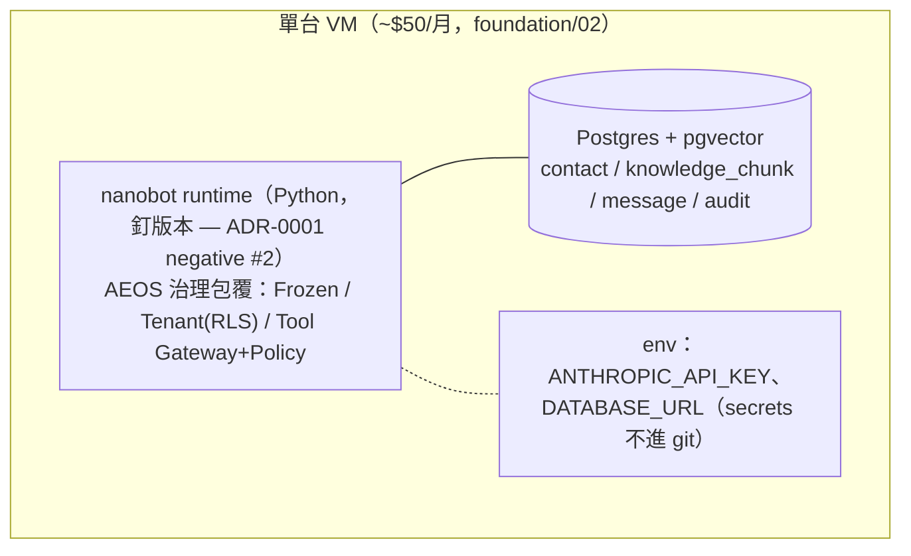
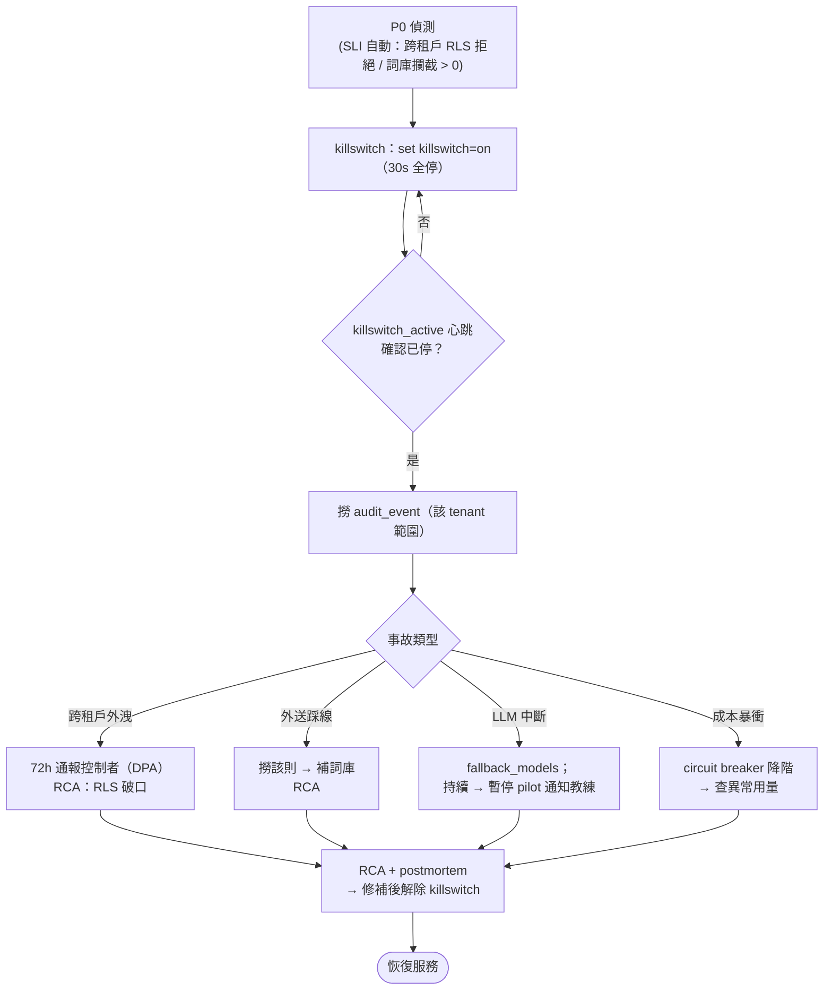

# Runbook + SLO — care-copilot（Pilot）

> **📋 Status**: draft
> **🗓 Last updated**: 2026-05-28
> **👤 Owner**: `devteam-ops`
> **🔖 Version**: v1
> **🎯 Scope**: care-copilot pilot runbook + SLO（1 tenant、單容器、單一 oncall=CEO）
> **🔗 Related**: NFR · ADR-0001 · `security/threat-model.md` · Observability 需求

---

## 1. 部署（nanobot runtime + AEOS 包覆）

- **凍結檢查**：部署前確認 nanobot 自我擴展（自裝 skill/自改 prompt/自由載 MCP）已關（ADR-0001）。
- **版本**：nanobot 釘 exact version；升級走 staging 驗證。

## 2. Kill Switch（鐵律，第一週就有）

- 機制：單一 flag（DB 或 env）→ runtime 讀取，**30s 內停止產草稿與回發**。
- 觸發時機：跨租戶外洩、外送踩線、成本失控、品質崩。
- 操作：`set killswitch=on` → 驗證無新草稿產生。

## 3. SLO / SLI（Pilot best-effort，非正式承諾）

| SLI | 目標 | Alert |
|:---|:---|:---|
| 草稿生成成功率 | best-effort | 連續失敗 → 通知 oncall |
| 草稿延遲 p95 | < 5s | 持續 > 10s 告警 |
| **跨租戶違規數** | **= 0** | **> 0 → P0 即停（killswitch）** |
| **外送踩線數** | **= 0** | **> 0 → P0** |
| 注入偵測（`prompt_injection_pattern_detected`） | 標記不阻擋 | 趨勢異常 → 人工複查 audit；**「忽略」也是 action**，非自動停（threat-model §防禦1） |
| 成本 / 直銷商 / 日 | ≤ $0.30 | 超 quota → circuit breaker 降階 + 告警 |
| 草稿採用率 | 監控趨勢 | 崩（<40%）→ 觸發 Kill 重評 |

## 4. Incident Response

| 事故 | 處置 |
|:---|:---|
| 跨租戶外洩 | killswitch → 稽核範圍 → 通報 → RCA（RLS 破口） |
| 外送踩線 | killswitch → 撈該則 audit → 補詞庫 |
| LLM API 中斷 | fallback_models；持續中斷 → 暫停 pilot 通知教練 |
| 成本暴衝 | circuit breaker 降階；查異常用量來源 |
| 資料復原 | 最壞 15 分鐘內（PRD §6）；從備份還原 |

### P0 Incident Response Activity（KB-07 ops 必畫；CEO 深夜照走）

## 5. Observability（實作 arch C4 列的需求）
- Metrics：Prometheus/簡易；Logs：structured + `conversation_id`；Traces：draft→policy→audit；Alerts：上表 P0 條件。
- Pilot 可先 log to stdout + 一張採用率列表（foundation/02），完整 stack 過早。

---

## 6. Review 修正 R2（2026-05-28，sre B-7）

### P0 first-responder runbook（CEO 深夜可照做）
每條 P0 標準 5 步：**detect → killswitch(`set killswitch=on`) → 撈 audit_event(該 tenant 範圍) → 通報 → RCA**。

### killswitch 驗證（防假停）
- `killswitch_active` 心跳 metric；觸發後 30s 內無新草稿的自動 assert。
- 違規 SLI 自動化：跨租戶=RLS 拒絕事件、踩線=詞庫攔截計數，**>0 自動觸發 killswitch**（非人工看 audit）。

### 成本 burn rate + RPO
- 每小時累計 vs 日預算 burn rate alert（50%/80%），不等日結。
- 補 RPO（備份頻率）；還原實測一次納 Go-checklist。
