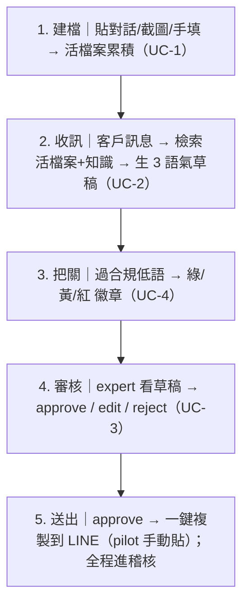
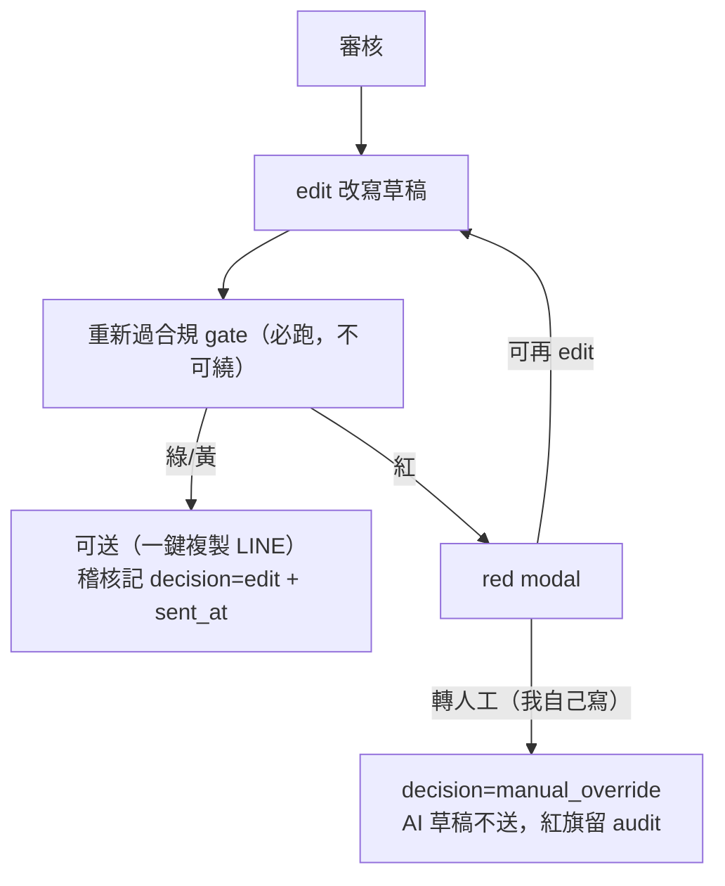

# User Flow — care-copilot（最薄切片，expert 視角）

> **📋 Status**: draft
> **🗓 Last updated**: 2026-05-28
> **👤 Owner**: `devteam-ux`
> **🔖 Version**: v1
> **🎯 Scope**: care-copilot expert 視角 user flow（草稿 + 合規 + 活檔案）。主 actor：直銷商/expert（Amy）
> **🔗 Related**: PRD §4 情境 1/3/6/7 · system-spec UC-1~4

---

## 主流程（happy path）

## 關鍵狀態覆蓋（每步都要有）

| 狀態 | 設計 |
|:---|:---|
| **empty** | 活檔案空 → 引導「貼上對話開始建檔」；無草稿 → 「點生成草稿」 |
| **loading** | 草稿生成中 → skeleton + 進度（p95<5s 內，不空白等待） |
| **error** | LLM 失敗 → 「暫時無法生成，已標需人工，稍後重試」 |
| **success** | 草稿 + 來源引用（citation）+ 合規徽章 |
| **needs_human** | 缺依據 → 明示「知識不足，建議人工回覆」，不給假草稿 |

## 合規 gate 的 UX（紅線是 hard stop）

| 燈 | UX |
|:---|:---|
| 🟢 green | 直接可送 |
| 🟡 yellow | 提醒一行，仍可送 |
| 🔴 red | 跳 modal：標出違規句 + 改寫建議；**送出鈕禁用**，必須採納改寫才解鎖（情境 7/12） |

## a11y / 裝置

- 主裝置 iPhone（PWA）；審核台手機優先、edit textarea 好操作
- 合規徽章不可只靠顏色（色盲）→ 配文字標籤（過/提醒/擋）
- WCAG 等級 pilot `<TBD>`（OQ-NFR-1）

## 兩軌標註

- 🟦 核心流程骨架（建檔→草稿→把關→審核→稽核）垂直無關，可複用
- 🟨 「貼截圖補健康關注」「3 語氣」「FTC 改寫話術」= Care Copilot pack 垂直特定

---

## Review 修正 R2（2026-05-28 multi-role review）

- **B-10 offline 狀態**：手機 PWA 必有斷網場景 → 新增 offline 列：草稿生成中斷網則本地暫存編輯內容，連線後續傳/重生，明示「離線，已暫存」。
- **C2 red-gate 逃生**：紅燈 modal 除「採納改寫」外，加「**改寫不適用 → 轉人工（我自己寫）**」鈕 → 不送 AI 草稿、記 audit、**不繞送出 gate**。error 與 needs_human 各給明確下一步鈕（別讓使用者愣住）。
- **B-10 a11y**：pilot 釘 **WCAG 2.1 AA**；screen reader 朗讀序（草稿 → citation → 徽章 → 鈕）；改寫/決定鈕 ≥44px 置拇指熱區。

## Review 修正 R3（2026-05-28 Gate 2 補審，ux B-1/S-2）

### UC-3 edit 閉環（edit → 重過合規，對齊 system-spec C2）

edit 中間態：顯示「重新檢查合規中…」loading；改完變紅燈要明示，不可靜默放行。

### partial-success state（補 state 矩陣）
| 狀態 | 設計 |
|:---|:---|
| **partial** | 3 語氣只生出 1-2 則 → 顯示已生成的 + 標「其餘語氣生成失敗，可重試該則」，不整批 fail |

### 高風險互動驗證假設（取代 `<TBD>` prototype）
- **red-gate hard stop**：假設「送出鈕禁用 + 強制改寫」能讓 expert 0 繞送踩線句（pilot 第一週觀察誤繞率，目標 0）。
- **edit 重送**：假設「edit 後一定重跑 gate」expert 可接受多一次等待（p95<5s）；若抱怨延遲，W2 改為 inline 即時掃。
- pilot 用真 expert 操作驗證，不另做 hi-fi prototype（最薄切片 best part is no part）。
